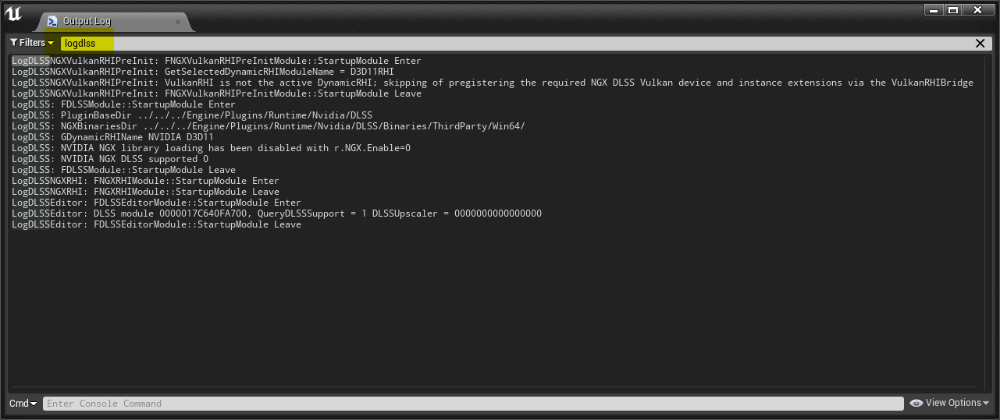
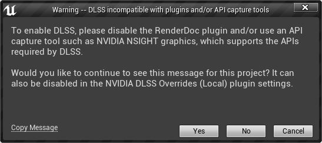
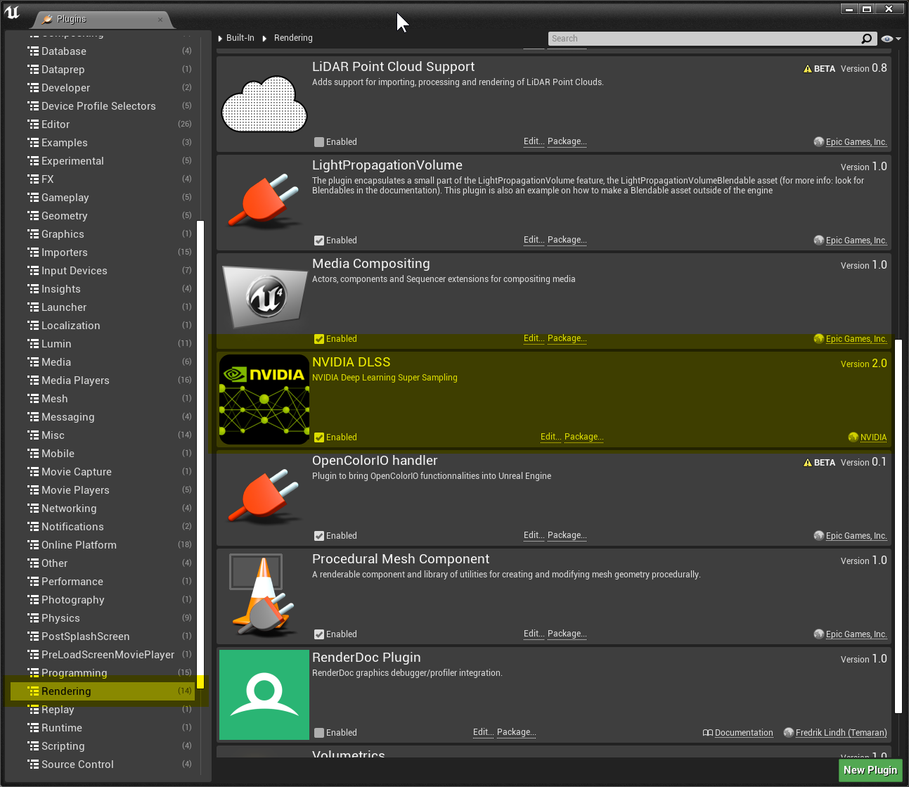
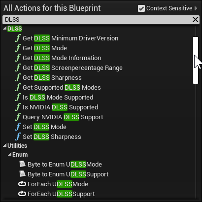
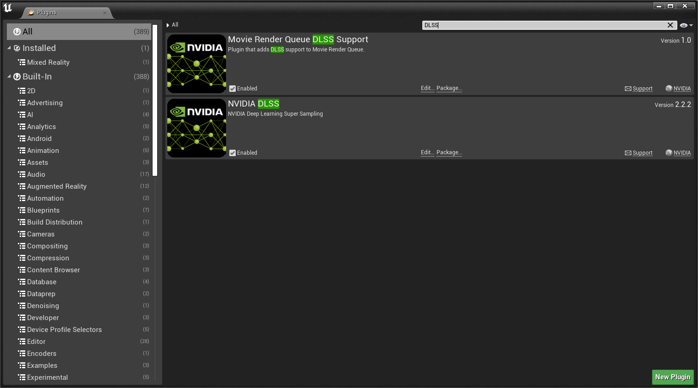
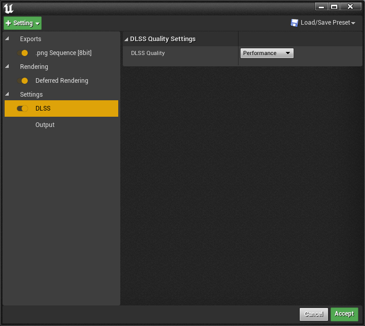

NVIDIA Unreal Engine DLSS/DLAA Plugin
=====================================

The NVIDIA *DLSS/DLAA* plugin is part of a wider suite of related NVIDIA performance and image quality improving technologies and corresponding NVIDIA Unreal Engine plugins:

- NVIDIA *Deep Learning Supersampling (DLSS)* is used to provide the highest possible frame rates at maximum graphics settings. *DLSS* requires an NVIDIA RTX graphics card.
- NVIDIA *Deep Learning Anti-Aliasing (DLAA)* is used to improve image quality. *DLAA* requires an NVIDIA RTX graphics card.
- NVIDIA *Image Scaling (NIS)* provides best-in class upscaling and sharpening for non-RTX GPUs, both NVIDIA or 3rd party. Please refer to the NVIDIA *Image Scaling* Unreal Engine plugin for further details.

# Quickstart

Please refer to the relevant section in this document for additional details.

1. Enable the *DLSS* plugin in the Editor, then restart the editor
2. DLSS in the Editor: enable the following settings in the Project Plugin settings
   1. Enable DLSS to be turned on in Editor viewports (it should be set by default)
   2. In the Viewport Options (downwards pointing arrow in the top left corner), use the DLSS Settings menu to toggle the different DLSS quality modes
3. DLSS/DLAA in [Blueprint](#dlss-blueprints):
   The `SetDLSSMode` and `EnableDLAA` functions of the DLSS blueprint library provide convenient functions for setting those console variables and are recommended to be used when integrating support into a project's user interface and settings.
4. DLSS in Game: make sure that the following [console variables](#command-line-options-and-console-variables-and-commands) are set to enable DLSS:
   1. r.NGX.Enable 1 (can be overriden on the command line with -ngxenable)
   2. r.NGX.DLSS.Enable 1
   3. r.NGX.DLSS.Quality -1
   4. r.NGX.DLSS.Quality.Auto false
   5. r.NGX.DLAA.Enable 0
5. DLAA in Game: make sure that the following [console variables](#command-line-options-and-console-variables-and-commands) are set to enable DLAA
   1. r.NGX.Enable 1 (can be overriden on the command line with -ngxenable)
   2. r.NGX.DLAA.Enable 1
6. Check the log for `LogDLSS: NVIDIA NGX DLSS supported 1`
7. (Optionally) Enable the DLSS on screen indicator in the bottom left of the screen via `\DLSS\Source\ThirdParty\NGX\Utils\ngx_driver_onscreenindicator.reg` to verify that DLSS is active

# Troubleshooting

## System requirements

- Windows 10, 64 bit
  - at least version v1709, Windows 10 Fall 2017 Creators Update 64-bit.
- NVIDIA Geforce Driver
  - Recommended: version 461.40 or higher
  - Required: version 445.00 or higher
- NVIDIA RTX GPU (GeForce, Titan or Quadro) with [DLSS](https://www.nvidia.com/en-us/geforce/technologies/dlss/) support
- UE project using either
  - Vulkan
  - DX11
  - DX12

## Diagnosing DLSS Issues in the Editor

The DLSS plugin shows various common reasons why DLSS might not be working at the top of the screen (in non-Shipping build configurations). This message can also be turned off in the DLSS plugin settings, as discussed in the "DLSS Plugin Settings" section in this document.


Additionally, the DLSS plugin modules write various information into the following UE log categories:

* LogDLSS
* LogDLSSEditor
* LogDLSSBlueprint
* LogDLSSNGXRHI
* LogDLSSNGXD3D11RHI
* LogDLSSNGXD3D12RHI
* LogDLSSNGXVulkanRHIPreInit
* LogDLSSNGXVulkanRHI
* LogDLSSNGX

Those can be accessed in the Editor under `Window -> Developer Tools -> Message Log`


The Message log then can be filtered to show only the DLSS related messages to get more information on why DLSS might not be functioning as expected, as shown in those examples.




## Incompatibilities with API Capture Tools such as RenderDoc

The Editor will show a warning at startup if DLSS incompatible API capture tools (such as RenderDoc) or plugins are used. To enable DLSS, please use an API capture tool such as [NVIDIA NSIGHT Graphics](https://developer.nvidia.com/nsight-graphics), which support the NGX APIs required by DLSS.



## Incompatibilities with Screenpercentage override in Post Procssing Volumes
When DLSS is active, the DLSS quality mode determines the effective screen percentage. As such screen percentage overrides specified in postprocessing volumes are ignored. This can lead to unexpected performance behavior when DLSS is turned on, compared to when DLSS is turned off.

## Incompatibilities with Depth of Field
As DLSS workload occurs in the same spot as TAAU in the pipeline, visual differences in DoF are expected. 
To minimize the differences, it is recommended to use DLSS in 'Quality' or 'Ultra Quality' modes. 
It is possible to tweak the DoF settings in the camera actor to compensate for the differences. 
Please keep in mind this is content dependent. Thus for some scenes the differences can be minimal and avoided while in other cases it might be more challenging.

## Verify Engine side plugin hooks

The following cvars should be set to those values by default:
- r.DefaultFeature.Antialiasing 2
- r.TemporalAA.Upscaler 1
- r.Reflections.Denoiser 2

## Enabling NGX DLSS Logging on End User machines

The DLSS plugin also pipes the NGX DLSS logs into the UE logging system into the `LogDLSSNGX` log category. It is enabled by default and can be tweaked with the `r.NGX.LogLevel` console variable, or set with the -NGXLogLevel=X command line option.

This requires an NVIDIA GeForce **driver version 461.36** or later.

## Enabling NGX DLSS Logging during Development

If r.NGX.EnableOtherLoggingSinks is set then additional NGX logging of the NVIDIA NGX software stack to files can be used as well, as discussed in the "NGX logging" chapter of the [DLSS Programming Guide](DLSS_Programming_Guide_Release.pdf) for details. The -NGXLogFileEnable and -NGXLogFileDisable command line options can also override the default setting.
The DLSS SDK provides registry keys which can be set with the following .reg files which can be found in the plugin folder under `\DLSS\Source\ThirdParty\NGX\Utils\`:
* `ngx_log_on.reg`
* `ngx_log_off.reg`
* `ngx_log_verbose.reg`

The DLSS plugin will write those into subfolder under `$(ProjectDir)\Saved\Logs\` with a `NGX_$(TimeStamp)_$(GUID)` pattern 
* `nvngx.log`
* `nvngx_dlss_2_1_34.log`
* `nvsdk_ngx.log`

## DLSS On-Screen Indicator

The DLSS SDK provides registry keys which can be set with the following .reg files which can be found in the plugin folder under `\DLSS\Source\ThirdParty\NGX\Utils\`:

* `ngx_driver_onscreenindicator.reg`
* `ngx_driver_off_screenindicator.reg`

With the first registry key set, DLSS will display an indicator on-screen when it is enabled, enabling easier troubleshooting. The second registry key can be used to disable this indicator again.

Please see the [DLSS Programming Guide](DLSS_Programming_Guide_Release.pdf) for further details.

# <a name="command-line-options-and-console-variables-and-commands">Command Line Options And Console Variables and Commands</a>

## Enabling DLSS (Engine Side)

The DLSS plugin uses various engine side hooks, which can be configured by the following cvars. Their default values

- r.DefaultFeature.Antialiasing (2, default)
  - Enable Temporal Anti-Aliasing
- r.TemporalAA.Upscaler (1, default)
  - Enable a custom TAAU upscaling plugin, such as the DLSS plugin
- r.Reflections.Denoiser (2, default)
  - Enable a custom denoising plugin. The DLSS plugin makes use of this to improve image quality for raytraced reflections by adding additionial TAA passes
  
## Enabling Motion vectors for DLSS
  
DLSS requires correct motion vectors to function properly. The following console variable can be used to render motion vectors for all objects, and not just the ones with dynamic geometry. This can be useful if it's infeasible to e.g. change all meshes to stationary or dynamic.

- r.BasePassForceOutputsVelocity (0, default)
  - Force the base pass to compute motion vector, regardless of FPrimitiveUniformShaderParameters.
  - 0: Disabled
  - 1: Enabled

## Enabling DLSS/DLAA (Plugin Side)

- r.NGX.Enable (1, default) can also be overriden on the command line with **-ngxenable** and **-ngxdisable**
  - Whether the NGX library should be loaded. This allow to have the DLSS plugin enabled but avoiding potential incompatibilities by skipping the driver side NGX parts of DLSS.
- r.NGX.DLSS.Enable (1, default)
  - Enable/Disable DLSS entirely.
- r.NGX.DLSS.Quality (-1, default)
  - DLSS Performance/Quality setting. **Note:** Not all modes might be supported at runtime, in this case Balanced mode is used
  - -2: Ultra Performance
  - -1: Performance (default)
  - 0: Balanced
  - 1: Quality
  - 2: Ultra Quality
- r.NGX.DLSS.Quality.Auto (false, default)
  - Whether the DLSS quality mode should be chosen dynamically based on viewport size. Overrides r.NGX.DLSS.Quality
- r.NGX.DLAA.Enable (false, default)
  - Enable/Disable DLAA. DLSS will be disabled while DLAA is enabled

**Blueprint** functions:
- `SetDLSSMode`, `GetDLSSMode`
- `IsDLSSSupported`, `QueryDLSSSupport`, `GetDLSSMinimumDriverVersion`, `GetDefaultDLSSMode`
- `IsDLSSModeSupported`, `GetSupportedDLSSModes`,`GetDLSSModeInformation`, `GetDLSSScreenPercentageRange`
- `EnableDLAA`, `IsDLAAEnabled`


## DLSS Runtime Image Quality Tweaks

- r.NGX.DLSS.DilateMotionVectors (1, default)
  - 0: pass low resolution motion vectors into DLSS
  - 1: pass dilated high resolution motion vectors into DLSS. This can help with improving image quality of thin details.

- r.NGX.DLSS.Reflections.TemporalAA (1, default)
  - Apply a temporal AA pass on the denoised reflections

- r.NGX.DLSS.WaterReflections.TemporalAA (1, default)
  - Apply a temporal AA pass on the denoised water reflections

- r.NGX.DLSS.Sharpness (0.0f off, default)
  - -1.0 to 1.0: Softening/sharpening to apply to the DLSS pass. Negative values soften the image, positive values sharpen.

- r.NGX.DLSS.EnableAutoExposure
  - 0: Use the engine-computed exposure value for input images to DLSS
  - 1: Enable DLSS internal auto-exposure instead of the application provided one - enabling this can alleviate effects such as ghosting in darker scenes (default)

- r.NGX.DLSS.PreferNISSharpen (2,default)
  - Prefer sharpening with an extra NIS plugin sharpening pass instead of DLSS sharpening if the NIS plugin is also enabled for the project.
  - Requires UE4.27.1 and the NIS plugin to be enabled, DLSS sharpening will be used otherwise.
    - 0: Softening/sharpening with the DLSS pass.
    - 1: Sharpen with the NIS plugin. Softening is not supported. Requires the NIS plugin to be enabled.
    - 2: Sharpen with the NIS plugin. Softening (i.e. negative sharpness) with the DLSS plugin . Requires the NIS plugin to be enabled.
   **Note** This cvar is only evaluated when using the `SetDLSSSharpness` Blueprint function, from either C++ or a Blueprint event graph!

**Blueprint** functions: 
- `SetDLSSSharpness`, `GetDLSSSharpness`

## DLSS Binaries

- r.NGX.BinarySearchOrder (0, default)
  - 0: automatic
    - use custom binaries from project and launch folder $(ProjectDir)/Binaries/ThirdParty/NVIDIA/NGX/$(Platform) if present
    - fallback to generic binaries from plugin folder
  - 1: force generic binaries from plugin folder, fail if not found
  - 2: force custom binaries from project or launch folder, fail if not found
  - 3: force generic development binaries from plugin folder, fail if not found. This is only supported in non-shipping build configurations

## DLSS memory usage

- `stat DLSS`
   - shows how much GPU memory DLSS uses and how many DLSS features, i.e. instances of DLSS are allocated. 
   - In steady state there should be 1 DLSS feature allocated per view. This value can increase temporarily, typically after changing the DLSS quality mode or resizing the window. This can be configured with the `r.NGX.FramesUntilFeatureDestruction` console variable

## NGX Project ID

The DLSS plugin by default uses the project identifier to initialize NGX and DLSS. On rare occasion, NVIDIA might provide a special NVIDIA NGX application ID. The following console variable determines which one is used.

r.NGX.ProjectIdentifier (0, default)
  - 0: automatic:
    - use NVIDIA NGX Application ID if non-zero, otherwise use UE Project ID
  - 1: force UE Project ID
  - 2: force NVIDIA NGX Application ID (set via the Project Settings -> NVIDIA DLSS plugin)

Please refer to the "Distributing DLSS" section for further details.

## Multi GPU Support (Experimental)

The DLSS plugin supports multiple GPUs in certain circumstances, as shown in the following table.
There AFR stands for Alternate-Frame-Rendering, i.e. SLI or CrossFire, and SFR stands for Split-Frame-Rendering, which is what the nDisplay plugin uses.

| RHI | AFR | SFR|
| --- | --- | --- |
|  D3D12RHI | no | conditionally|
|  D3D11RHI| yes| no|
|  VulkanRHI| no | no|

Notes: 
- D3D12RHI
  - AFR is not supported
    - Primarily due to higher level renderer code not maintaining TAA (and thus DLSS) history across non-consecutive frames on the same GPU
  - SFR is conditionally supported 
    - Support requires a custom nDisplay plugin to enable calling into the DLSS plugin
    - Please refer to the [NvRTX](https://github.com/NvRTX/UnrealEngine) GitHub repository
    - GPUs are expected to be in Linked Display Adapter (LDA) mode 
    - **This will not work with unmodified engine distributions, such as those from the Epic Games Launcher**

- D3D11RHI
  - AFR is supported via driver based, automatic SLI support
  
- VulkanRHI
  - The VulkanRHI (as of UE 4.27) does not implement explicit MGPU, and thus neither AFR nor SFR are available

The following console variables can be used to adjust how DLSS interacts with the GPU nodes

- r.NGX.DLSS.FeatureCreationNode (-1, default)
  - Determines which GPU the DLSS feature is getting created on
  - -1: Create on the GPU the command list is getting executed on
  -  0: Create on GPU node 0
  -  1: Create on GPU node 1
   
- r.NGX.DLSS.FeatureVisibilityMask (-1, default)
  - Determines which GPU the DLSS feature is visible to
  - -1: Visible to the GPU the command list is getting executed on
  -  1: visible to GPU node 0
  -  2:  visible to GPU node 1
  -  3:  visible to GPU node 0 and GPU node 1


## Miscellaneous

- r.NGX.DLSS.AutomationTesting (0, default)
  - Whether the NGX library should be loaded when GIsAutomationTesting is true.(default is false)
  - Must be set to true before startup. This can be enabled for cases where running automation testing with DLSS is desired
- r.NGX.Automation.Enable (0, default)
  - Enable automation for NGX DLSS image quality and performance evaluation.
- r.NGX.Automation.ViewIndex (0, default)
  - Select which view to use with NGX DLSS image quality and performance automation.
- r.NGX.Automation.NonGameViews (0,default)
  - Enable non-game views for NGX DLSS image quality and performance automation. 
- r.NGX.FramesUntilFeatureDestruction (3, default)
  - Number of frames until an unused NGX feature gets destroyed
- r.NGX.DLSS.MinimumWindowsBuildVersion (16299, default for v1709)
  - Sets the minimum Windows 10 build version required to enable DLSS
- r.NGX.LogLevel (1, default)
  - Determines the minimal amount of logging the NGX implementation. Please refer to the DLSS plugin documentation on other ways to change the logging level.
   - 0: off
   - 1: on 
   - 2: verbose
- r.NGX.EnableOtherLoggingSinks (0, default)
  - Determines whether the NGX implementation will turn on additional log sinks LogDLSSNGXRHI
  - 0: off
  - 1: on
- r.NGX.RenameNGXLogSeverities (1, default)
  - Renames 'error' and 'warning' in messages returned by the NGX log callback to 'e_rror' and 'w_arning' before passing them to the UE log system
  - 0: off
  - 1: on, for select messages during initalization
  - 2: on, for all messages
- r.NGX.DLSS.ReleaseMemoryOnDelete  (1, default)
  - Enable/disable releasing DLSS related memory on the NGX side when DLSS features get released

# DLSS and the NIS NVIDIA Image Scaling plugin (UE 4.27.1+)

The *DLSS* plugin and NVIDIA Image Scaling (*NIS*) plugins can be enabled together for the same project. Please see the `RTX UI Developer Guidelines` document for suggested UI implementations.

When both the *DLSS* and *NIS* plugins are enabled for a project, NIS will be used instead of DLSS sharpening. See `r.NGX.DLSS.PreferNISSharpen` for details.

# DLSS in the Editor

## Enabling DLSS for a project 



## Enabling DLSS in Level Editor Viewports

With "Enable DLSS to be turned on in Editor viewports" set in the project plugin settings, (on by default), the DLSS mode can be turned on in level editor viewports like this. Each viewport can have a different DLSS mode.


## DLSS Plugin Settings

Some of the "Level Editor - Viewport" settings are split across two config files and settings pages to tailor how DLSS is interacting with the editor user experience. 

For example, a cross-platform game project might find it more practical by default to only have DLSS enabled in "Play In Editor Viewports" or in "game mode" in order to maintain a consistent content authoring experience across the range of supported platforms.
However projects (e.g. an architecture visualization project with notable raytracing workloads), might find it more useful to have DLSS enabled during the content authoring. Either way each user can override those settings locally:

- `Project Settings -> Plugins -> NVIDIA DLSS`
  - stored in DefaultEngine.ini
  - typically resides in source control. 
  - settings here are shared between users 
- `Project Settings -> Plugins -> NVIDIA DLSS (Local)`
  - stored UserEngine.ini
  - not recommended to be checked into source control. 
  - allow a user to override project wide settings if desired. Defaults to "use project settings"


## <a name="dlss-blueprints">DLSS Blueprints</a>

The UDLSSLibrary blueprint library provides functionality to query whether DLSS and which modes are supported. It also provides convenient functions to enable the underlying DLSS console variables. The tooltips of each function provide additional information.

Using the UDLSSLibrary via blueprint or C++ (by including the DLSSBlueprint module in a game project) is recommended over setting the console variables directly. This will make sure that any future updates will be picked up by simply updating the DLSS plugin, without having to update the game logic.



## DLSS Movie Render Queue Support (UE 4.27)

Starting with UE4.27 DLSS supports the DLSS when rendering movies with the Movie Render Queue plugin.

0. Enable the *Movie Render Queue* and *DLSS* plugins in the Editor
1. Enable the *Movie Render Queue DLSS Support* plugin in the Editor, then restart the editor
2. In the configuration, add the `Settings -> DLSS` page
3. In the DLSS settings page, change the desired DLSS quality mode
   1. Note: Unsupported DLSS modes will show a warning at the bottom of the window
4. Optional: The  `Settings -> Output -> File Name Format` page supports a `{dlss_quality}` format tag

**Note:** Only the *Deferred Rendering* render pass is supported with DLSS, all other passes use the built-in TAA







## DLSS nDisplay support (NVRTX only)

**Unmodified engine distributions, such as those from the Epic Games Launcher do not support DLSS with the nDisplay plugin.**

The [NvRTX](https://github.com/NvRTX/UnrealEngine) GitHub repository hosts a modified version of the nDisplay plugin that has those changes to the nDisplay plugin:

At the top of `\Engine\Plugins\Runtime\nDisplay\Source\DisplayCluster\Private\Game\EngineClasses\Basics\DisplayClusterViewportClient.cpp`, right after the existing header includes around line 50, add this block:

```
#include "CustomStaticScreenPercentage.h"

static TAutoConsoleVariable<int32>  CVarAllowTemporalUpsampling(
	TEXT("nDisplay.render.TemporalUpsampling"),
	1,
	TEXT("Allow custom upscaler plugins when rendering with nDisplay"),
	ECVF_Default
);
```

And in  `UDisplayClusterViewportClient::Draw`, around line 510, add this before the block that checks whether the view family has a screenpercentage interface set or not:

```
if (CVarAllowTemporalUpsampling.GetValueOnGameThread() && GCustomStaticScreenPercentage && ViewFamily.ViewMode == EViewModeIndex::VMI_Lit)
{
	GCustomStaticScreenPercentage->SetupMainGameViewFamily(ViewFamily);

	// Regular GameViewport set the primary screenpercentage mode elsewhere
	if (ViewFamily.GetTemporalUpscalerInterface())
	{
		for (FSceneView* View : Views)
		{
			View->PrimaryScreenPercentageMethod = EPrimaryScreenPercentageMethod::TemporalUpscale;
		}
	}
}
```

The `nDisplay.render.TemporalUpsampling` console variable then can be used to enable/disable calling into the DLSS plugin.
The usual DLSS blueprint functionality can then be used to configure DLSS.


# Distributing DLSS

The DLSS plugin ships with a ready-to-use production DLSS binary (without watermarks) and uses the project identifier to initialize NGX and DLSS. This is the common case for distribution to end users and does not require further actions from either your or NVIDIA's side.
On rare occasion NVIDIA however might provide:

1. a custom project specific DLSS binary
2. an NVIDIA application ID

In that case those can be configured in the advanced plugin settings. Additionally please also ensure that the r.NGX.ProjectIdentifier console variable is set to either 0 (the default) or 2.
The project plugin settings can be used to configure those (please see above).

1. The custom, project specific DLSS binary `nvngx_dlss.dll` should be put into the project under `$(ProjectDir)/Binaries/ThirdParty/NVIDIA/NGX/$(Platform)`
2. Setting the NVIDIA NGX application ID for the project.
  

Please refer to "Chapter 4 Distributing DLSS in a Game" in the the [DLSS Programming Guide](DLSS_Programming_Guide_Release.pdf) for details.

# DLSS API and UI Documentation

The [DLSS Programming Guide](DLSS_Programming_Guide_Release.pdf) provides details about the NVIDIA NGX APIs which are used by the plugin to implement DLSS.

The [RTX UI Developer Guidelines](RTX%20UI%20Developer%20Guidelines.pdf) ([Chinese](RTX%20UI%20Developer%20Guidelines%20Chinese%20Version.pdf)) provides details about recommended game settings and UI for DLSS.

The NVIDIA Developer Blog [Tips: Getting the Most out of the DLSS Unreal Engine 4 Plugin](https://developer.nvidia.com/blog/tips-getting-the-most-out-of-the-dlss-unreal-engine-4-plugin/) provides best practices along with other tips and tricks to use NVIDIA DLSS in Unreal Engine games and applications.
