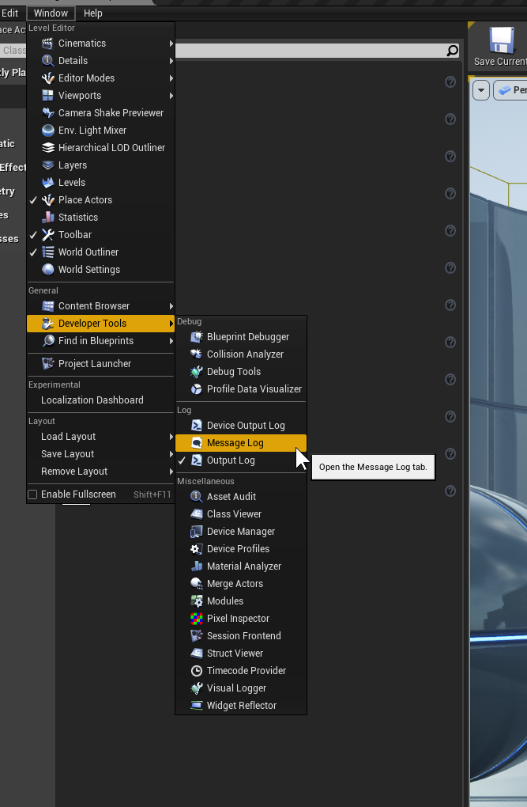
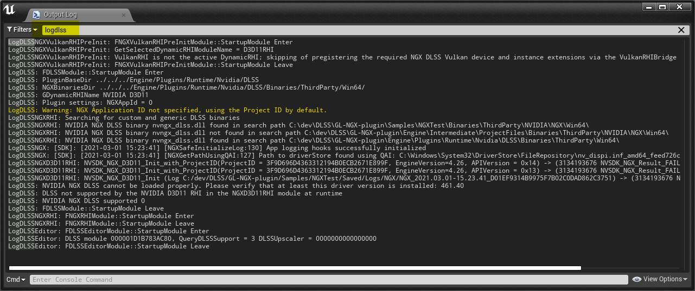
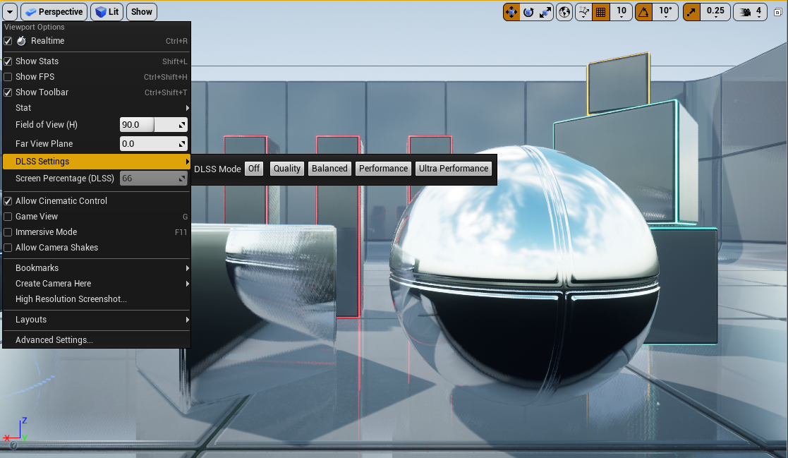
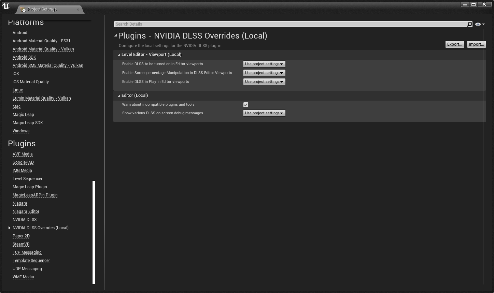
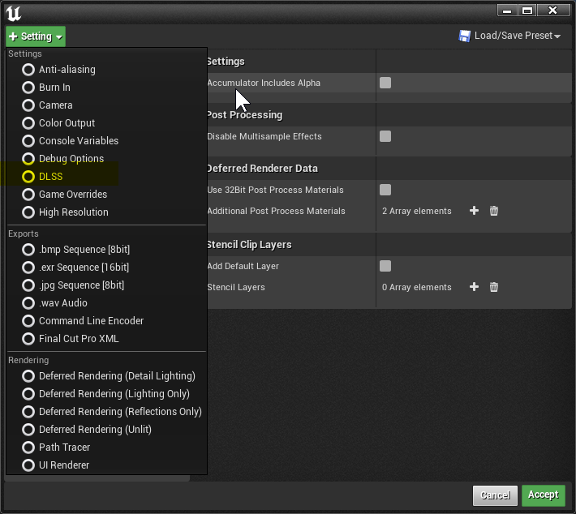
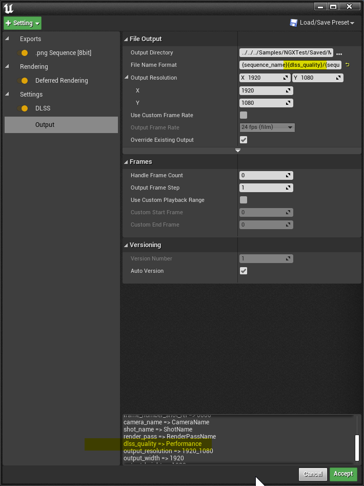

NVIDIA Unreal Engine DLSS/DLAA Plugin
=====================================

NVIDIA *DLSS/DLAA*插件是NVIDIA性能和图像质量改进技术套件的一部分，以及相应的NVIDIA虚幻引擎插件：

- NVIDIA *深度学习超采样(DLSS)* 用于在最大图形设置下提供尽可能高的帧速率。*DLSS* 需要NVIDIA RTX显卡。
- NVIDIA *深度学习抗锯齿(DLAA)* 用于提高图像质量。*DLAA* 需要NVIDIA RTX显卡。
- NVIDIA *Image Scaling (NIS)* 为非rtx gpu (NVIDIA或第三方)提供一流的升级和锐化。请参考NVIDIA *图像缩放*虚幻引擎插件了解更多详细信息。（也就是你不是RTX系列显卡，你可以通过NIS来提升你品质）

# 快速开始


详情请参阅本文件的相关章节。

1. 在编辑器中启用*DLSS*插件，然后重新启动编辑器
2. 编辑器中的DLSS:在项目插件设置中启用以下设置
   1. 在编辑器视口中启用DLSS(应该默认设置)
   2. 在Viewport Options(左上角的向下箭头)中，使用DLSS Settings菜单切换不同的DLSS质量模式
3. 在蓝图中使用DLSS/DLAA i:
   DLSS蓝图库的“SetDLSSMode”和“EnableDLAA”函数为设置这些控制台变量提供了方便的函数，建议在将支持集成到项目的用户界面和设置时使用。
   
1. DLSS在游戏中:确认以下控制台变量是否被启用 [console variables](#command-line-options-and-console-variables-and-commands) 来启动 DLSS:
   1. r.NGX.Enable 1 (can be overriden on the command line with -ngxenable)
   2. r.NGX.DLSS.Enable 1
   3. r.NGX.DLSS.Quality -1
   4. r.NGX.DLSS.Quality.Auto false
   5. r.NGX.DLAA.Enable 0
2. DLAA 在游戏中: 确认以下控制台变量是否被启用 [console variables](#command-line-options-and-console-variables-and-commands) 来启动 DLAA
   1. r.NGX.Enable 1 (can be overriden on the command line with -ngxenable)
   2. r.NGX.DLAA.Enable 1
3. 检查日志 `LogDLSS: NVIDIA NGX DLSS supported 1`
4. (Optionally) 启用DLSS屏幕上的指示器在屏幕的左下方通过`\DLSS\Source\ThirdParty\NGX\Utils\ngx_driver_onscreenindicator.reg` 来确认DLSS已经启用

# 故障排除
## 系统要求
- Windows 10, 64 bit
  - at least version v1709, Windows 10 Fall 2017 Creators Update 64-bit.
- NVIDIA Geforce Driver
  - Recommended: version 461.40 or higher
  - Required: version 445.00 or higher
- NVIDIA RTX GPU (GeForce, Titan or Quadro) with [DLSS](https://www.nvidia.com/en-us/geforce/technologies/dlss/) support
- UE project using either
  - Vulkan
  - DX11
  - DX12

## 在编辑器中诊断DLSS

DLSS插件显示了为什么DLSS不能在屏幕顶部工作的各种常见原因(在非发布构建配置中)。此消息也可以在DLSS插件设置中关闭，如本文档中的“DLSS插件设置”部分所述。


此外，DLSS插件模块将各种信息写入以下UE日志类别:

* LogDLSS
* LogDLSSEditor
* LogDLSSBlueprint
* LogDLSSNGXRHI
* LogDLSSNGXD3D11RHI
* LogDLSSNGXD3D12RHI
* LogDLSSNGXVulkanRHIPreInit
* LogDLSSNGXVulkanRHI
* LogDLSSNGX

这些可以在编辑器下访问 `Window -> Developer Tools -> Message Log`



然后可以过滤Message日志，只显示与DLSS相关的消息，以获得关于DLSS为何不能按预期运行的更多信息，如上述示例所示。





## 与API捕获工具(如RenderDoc)不兼容

如果使用了DLSS不兼容的API捕获工具(如RenderDoc)或插件，编辑器将在启动时显示警告。要启用DLSS，请使用API捕获工具，如[NVIDIA NSIGHT Graphics](https://developer.nvidia.com/nsight-graphics)，它支持DLSS所需的NGX API。


## 与后处理卷中的屏幕百分比覆盖不兼容
当DLSS激活时，DLSS质量模式决定有效屏幕百分比。因此，在后处理卷中指定的屏幕百分比覆盖将被忽略。与关闭DLSS相比，打开DLSS时可能会导致意想不到的性能提升。


## 与景深不兼容
由于DLSS工作负载发生在管道中与TAAU相同的位置，因此DoF的视觉差异是可以预期的。
为了尽量减少差异，建议在“质量”或“超质量”模式下使用DLSS。
可以在相机actor中调整DoF设置来补偿这些差异。
请记住，这取决于内容。因此，对于某些场景，差异可以最小化并避免，而在其他情况下，它可能更具挑战性。


## 验证引擎侧插件挂钩
以下cvars应默认设置为这些值:
- r.DefaultFeature.Antialiasing 2
- r.TemporalAA.Upscaler 1
- r.Reflections.Denoiser 2

## 在终端用户机器上启用NGX DLSS日志
DLSS插件还将NGX DLSS日志输送到UE日志系统的“LogDLSSNGX”日志类别中。它在默认情况下是启用的，可以通过' r.NGX '进行调整。LogLevel '控制台变量，或者使用-NGXLogLevel=X命令行选项设置。

This requires an NVIDIA GeForce **driver version 461.36** or later.

## 在开发过程中启用NGX DLSS日志
如果设置了r.NGX.EnableOtherLoggingSinks，那么NVIDIA NGX软件堆栈的额外NGX日志记录文件也可以使用，详细信息请参见[DLSS编程指南](DLSS_Programming_Guide_Release.pdf)的“NGX日志记录”章节。命令行选项-NGXLogFileEnable和-NGXLogFileDisable也可以覆盖默认设置。
DLSS SDK提供了注册表项，可以使用下面的.reg文件进行设置，这些文件可以在下面的插件文件夹中找到`\DLSS\Source\ThirdParty\NGX\Utils\`:
* `ngx_log_on.reg`
* `ngx_log_off.reg`
* `ngx_log_verbose.reg`

DLSS插件会将这些文件写入“\$(ProjectDir)\\Saved\\Logs\”下的子文件夹中，并使用“NGX_\$(TimeStamp)\_$(GUID)”模式
* `nvngx.log`
* `nvngx_dlss_2_1_34.log`
* `nvsdk_ngx.log`

## ## DLSS屏幕指示

DLSS SDK提供了注册表项，可以使用下面的.reg文件进行设置，这些文件可以在下面的插件文件夹中找到
`\DLSS\Source\ThirdParty\NGX\Utils\`:

* `ngx_driver_onscreenindicator.reg`
* `ngx_driver_off_screenindicator.reg`

通过设置第一个注册表项，DLSS在启用时将在屏幕上显示一个指示器，从而更容易进行故障排除。第二个注册表项可用于再次禁用此指示器。

Please see the [DLSS Programming Guide](DLSS_Programming_Guide_Release.pdf) for further details.

# <a name="command-line-options-and-console-variables-and-commands">Command Line Options And Console Variables and Commands</a>

## ##启用DLSS(引擎端)

The DLSS plugin uses various engine side hooks, which can be configured by the following cvars. Their default values
DLSS插件使用各种引擎侧钩子，可以通过以下cvars进行配置。它们的默认值

- r.DefaultFeature.Antialiasing (2, default)
  - 启用临时抗锯齿(TAA)
- r.TemporalAA.Upscaler (1, default)
  - 启用自定义TAAU升级插件，例如DLSS插件
- r.Reflections.Denoiser (2, default)
  - 启用自定义去噪插件。DLSS插件利用这一点，通过添加额外的TAA通道来提高光线跟踪反射的图像质量
  
## 启用DLSS的运动向量
  
DLSS需要正确的运动向量才能正常工作。下面的控制台变量可以用于渲染所有对象的运动向量，而不仅仅是具有动态几何的对象。这可以是有用的，如果它是不可行的，例如改变所有的网格静止或动态。

- r.BasePassForceOutputsVelocity (0, default)
  - 强制基础通道计算运动矢量，不管FPrimitiveUniformShaderParameters。
  - 0: Disabled
  - 1: Enabled

## ##启用DLSS/DLAA(插件端)

- r.NGX.Enable (1, default) can also be overriden on the command line with **-ngxenable** and **-ngxdisable**
  - 是否加载NGX库。这样可以启用DLSS插件，但避免了潜在的不兼容性，因为跳过了DLSS的驱动端NGX部分。
- r.NGX.DLSS.Enable (1, default)
  - 完全启用/禁用DLSS
- r.NGX.DLSS.Quality (-1, default)
  - 性能/质量设置。**注意:** 在运行时可能不支持所有模式，在这种情况下使用平衡模式
  - -2: Ultra Performance
  - -1: Performance (default)
  - 0: Balanced
  - 1: Quality
  - 2: Ultra Quality
- r.NGX.DLSS.Quality.Auto (false, default)
  - 是否应该根据视口大小动态选择DLSS质量模式。覆盖r.NGX.DLSS.Quality
- r.NGX.DLAA.Enable (false, default)
  - 启用/禁用DLAA。启用DLAA时，将禁用DLSS

**Blueprint** functions:
- `SetDLSSMode`, `GetDLSSMode`
- `IsDLSSSupported`, `QueryDLSSSupport`, `GetDLSSMinimumDriverVersion`, `GetDefaultDLSSMode`
- `IsDLSSModeSupported`, `GetSupportedDLSSModes`,`GetDLSSModeInformation`, `GetDLSSScreenPercentageRange`
- `EnableDLAA`, `IsDLAAEnabled`


## DLSS Runtime Image Quality Tweaks

- r.NGX.DLSS.DilateMotionVectors (1, default)
  - 0: 通过低分辨率的运动矢量到DLSS
  - 1: 通过放大的高分辨率运动矢量到DLSS。这有助于改善薄细节的图像质量。

- r.NGX.DLSS.Reflections.TemporalAA (1, default)
  - 在去噪反射上应用临时AA通道(令人好奇UE5 的TRS会不会干不过DLSS，不如DLSS配合TAA)

- r.NGX.DLSS.WaterReflections.TemporalAA (1, default)
  - 在降噪的水反射上应用暂时的AA通道

- r.NGX.DLSS.Sharpness (0.0f off, default)  `这个锐化优点东西`
  - -1.0到1.0:软化/锐化应用于DLSS通道。负值使图像柔和，正值使图像锐利。

- r.NGX.DLSS.EnableAutoExposure
  - 0: 使用引擎计算的曝光值为输入图像到DLSS
  - 1: 启用DLSS内部自动曝光，而不是应用程序提供的自动曝光——启用这个可以缓解在黑暗场景中重影等效果(default)

- r.NGX.DLSS.PreferNISSharpen (2,default)  `这个锐化优点东西`
  - 如果项目也启用了NIS插件，则更倾向于使用额外的NIS插件锐化通道而不是DLSS锐化。
  - 需要UE4.27.1和NIS插件启用，否则将使用DLSS锐化。
    - 0: 用DLSS通道软化/锐化。
    - 1: 使用NIS插件进行锐化。不支持软化。需要启用NIS插件。
    - 2: 使用NIS插件进行锐化。使用DLSS插件软化(即负锐度)。需要启用NIS插件。
   **Note** This cvar is only evaluated when using the `SetDLSSSharpness` Blueprint function, from either C++ or a Blueprint event graph!

**Blueprint** functions: 
- `SetDLSSSharpness`, `GetDLSSSharpness`

## DLSS Binaries 二进制文件

- r.NGX.BinarySearchOrder (0, default)
  - 0: automatic
    - 如果存在，请使用项目和启动文件夹$(ProjectDir)/ binaries /ThirdParty/NVIDIA/NGX/$(Platform)中的自定义二进制文件
    - 从插件文件夹回退到通用二进制文件
  - 1: 强制通用二进制从插件文件夹，如果没有找到失败
  - 2: 强制自定义二进制文件从项目或启动文件夹，如果没有找到失败
  - 3: 从插件文件夹强制通用开发二进制文件，如果找不到则失败。这只在非发布的构建配置中得到支持

## DLSS memory usage

- `stat DLSS`
   - 显示了DLSS使用了多少GPU内存以及有多少DLSS特性，即分配了多少DLSS实例。 
   - 在稳定状态下，每个视图应该分配1个DLSS特性。这个值可以临时增加，通常是在更改DLSS质量模式或调整窗口大小之后。这可以通过`r.NGX.FramesUntilFeatureDestruction`的控制台变量

## NGX 项目ID

DLSS插件默认使用项目标识符来初始化NGX和DLSS。在极少数情况下，NVIDIA可能会提供一个特殊的NVIDIA NGX应用程序ID。下面的控制台变量决定使用哪个变量。

r.NGX.ProjectIdentifier (0, default)
  - 0: automatic:
    - 如果非零则使用NVIDIA NGX应用程序ID，否则使用UE项目ID
  - 1: 强制 UE 项目ID
  - 2: 强制NVIDIA NGX应用程序ID(通过项目设置-> NVIDIA DLSS插件设置)

详情请参阅“分发DLSS”部分。

## 多GPU支持 (实验性)

DLSS插件在某些情况下支持多个gpu，如下表所示。
AFR代表交替帧渲染，即SLI或交叉火力，而SFR代表分割帧渲染，这是nDisplay插件所使用的。

| RHI | AFR | SFR|
| --- | --- | --- |
|  D3D12RHI | no | conditionally|
|  D3D11RHI| yes| no|
|  VulkanRHI| no | no|

Notes: 
- D3D12RHI
  - AFR 不支持
    - 主要是由于高级渲染器代码不维护同一GPU上非连续帧之间的TAA(因此是DLSS)历史
  - SFR 有条件支持
    - 支持需要一个自定义的nDisplay插件来调用DLSS插件
    - 请参考[NvRTX](https://github.com/NvRTX/UnrealEngine) GitHub存储库（简单的就是现在用的这个版本）
    - gpu预计将处于链接显示适配器(LDA)模式
    - **这将不适用于未经修改的引擎发行版，如Epic Games Launcher**

- D3D11RHI
  - AFR支持基于驱动程序，自动SLI支持
  
- VulkanRHI
  - VulkanRHI(截至UE 4.27)没有实现显式MGPU，因此AFR和SFR都不可用

下面的控制台变量可以用来调整DLSS与GPU节点的交互方式

- r.NGX.DLSS.FeatureCreationNode (-1, default)
  - 决定DLSS特性创建在哪个GPU上
  - -1: 在执行命令列表的GPU上创建
  -  0: 在图形处理器节点0上创建
  -  1: 在图形处理器节点1上创建
   
- r.NGX.DLSS.FeatureVisibilityMask (-1, default)
  - 决定DLSS特性对哪个GPU可见
  - -1: 对于正在执行命令列表的GPU可见
  -  1: GPU节点0可见
  -  2:  GPU节点1可见
  -  3:  GPU节点0和1可见


## Miscellaneous（杂项）

- r.NGX.DLSS.AutomationTesting (0, default)
  - 当GIsAutomationTesting为true时是否加载NGX库。(默认为false)
  - 必须在启动前设置为true。这可以在需要使用DLSS运行自动化测试的情况下启用
- r.NGX.Automation.Enable (0, default)
  - 启用NGX DLSS图像质量和性能评估自动化。
- r.NGX.Automation.ViewIndex (0, default)
  - Select which view to use with NGX DLSS image quality and performance automation.
- r.NGX.Automation.NonGameViews (0,default)
  - 为NGX DLSS图像质量和性能自动化启用非游戏视图。 
- r.NGX.FramesUntilFeatureDestruction (3, default)
  - 帧数，直到一个未使用的NGX特性被销毁
- r.NGX.DLSS.MinimumWindowsBuildVersion (16299, default for v1709)
  - 设置启用DLSS所需的最低Windows 10构建版本
- r.NGX.LogLevel (1, default)
  - 确定NGX实现的最小日志量。关于更改日志级别的其他方法，请参考DLSS插件文档。
   - 0: off
   - 1: on 
   - 2: verbose
- r.NGX.EnableOtherLoggingSinks (0, default)
  - 确定NGX实现是否会打开额外的日志接收器LogDLSSNGXRHI
  - 0: off
  - 1: on
- r.NGX.RenameNGXLogSeverities (1, default)
  - 将NGX日志回调返回的消息中的“error”和“warning”重命名为“e_rror”和“w_arning”，然后将它们传递给UE日志系统
  - 0: off
  - 1: on, for select messages during initalization
  - 2: on, for all messages
- r.NGX.DLSS.ReleaseMemoryOnDelete  (1, default)
  - 当DLSS特性释放时，在NGX端启用/禁用释放DLSS相关内存

# DLSS and the NIS NVIDIA Image Scaling plugin (UE 4.27.1+)

*DLSS*插件和NVIDIA Image Scaling (*NIS*)插件可以在同一个项目中同时启用。请参阅“RTX UI开发者指南”文档，了解建议的UI实现。

当一个项目同时启用了*DLSS*和*NIS*插件时，将使用NIS而不是DLSS锐化。查看`r.NGX.DLSS`。prefernissharper详细信息。

# DLSS in the Editor

## 为项目启用DLSS 


## 在关卡编辑器视口中启用DLSSs

通过在项目插件设置中设置“在编辑器视口中启用DLSS”(默认开启)，可以在关卡编辑器视口中开启DLSS模式。`每个视口可以有不同的DLSS模式`。



## DLSS 插件设置

一些“关卡编辑器-视口”设置被分割到两个配置文件和设置页面中，以调整DLSS与编辑器用户体验的交互方式。

例如，一个跨平台游戏项目可能会发现，在默认情况下，只在“在编辑器中播放”或“游戏模式”中启用DLSS更实用，以便在支持的平台范围内保持一致的内容创作体验。
然而，项目(例如具有显著光线跟踪工作负载的架构可视化项目)可能会发现在内容创作期间启用DLSS更有用。无论哪种方式，每个用户都可以在本地覆盖这些设置:

- `Project Settings -> Plugins -> NVIDIA DLSS`
  - 存储在DefaultEngine.ini中
  - 通常存在于源代码控制中。
  - 这里的设置在用户之间共享
- `Project Settings -> Plugins -> NVIDIA DLSS (Local)`
  - 存储UserEngine.ini
  - 不建议检入源代码控制。
  - 如果需要，允许用户覆盖项目范围设置。默认为“使用项目设置”





## <a name="dlss-blueprints">DLSS Blueprints</a>

The UDLSSLibrary blueprint library provides functionality to query whether DLSS and which modes are supported. It also provides convenient functions to enable the underlying DLSS console variables. The tooltips of each function provide additional information.

Using the UDLSSLibrary via blueprint or C++ (by including the DLSSBlueprint module in a game project) is recommended over setting the console variables directly. This will make sure that any future updates will be picked up by simply updating the DLSS plugin, without having to update the game logic.


## DLSS 渲染列队支持(UE 4.27)

从UE4.27开始，DLSS在使用电影渲染队列插件渲染电影时支持DLSS。

0. 在编辑器中启用*Movie Render Queue*和*DLSS*插件
1. 在编辑器中启用*Movie Render Queue DLSS Support*插件，然后重新启动编辑器
2. 在配置中，添加“Settings -> DLSS”页面
3. 在DLSS设置页面，更改所需的DLSS质量模式
   1. 注意:不支持的DLSS模式将在窗口底部显示警告
4. 可选:“设置->输出->文件名格式”页面支持“{dlss_quality}”格式标签

**Note:** DLSS只支持*Deferred Rendering*渲染通道，所有其他通道都使用内置的TAA






## DLSS nDisplay 支持(NVRTX only)

**未修改的引擎发行版，如Epic Games Launcher不支持带有nDisplay插件的DLSS**


[NvRTX](https://github.com/NvRTX/UnrealEngine) GitHub存储库托管了nDisplay插件的修改版本，对nDisplay插件进行了这些更改:

在这个文件中 `\Engine\Plugins\Runtime\nDisplay\Source\DisplayCluster\Private\Game\EngineClasses\Basics\DisplayClusterViewportClient.cpp`, 在已有的头文件的第50行左右，添加这个块:

```
#include "CustomStaticScreenPercentage.h"

static TAutoConsoleVariable<int32>  CVarAllowTemporalUpsampling(
	TEXT("nDisplay.render.TemporalUpsampling"),
	1,
	TEXT("Allow custom upscaler plugins when rendering with nDisplay"),
	ECVF_Default
);
```

在 `UDisplayClusterViewportClient::Draw`中，大约在第510行，在检查视图族是否有屏幕百分比接口集的块之前添加这个:

```
if (CVarAllowTemporalUpsampling.GetValueOnGameThread() && GCustomStaticScreenPercentage && ViewFamily.ViewMode == EViewModeIndex::VMI_Lit)
{
	GCustomStaticScreenPercentage->SetupMainGameViewFamily(ViewFamily);

	// Regular GameViewport set the primary screenpercentage mode elsewhere
	if (ViewFamily.GetTemporalUpscalerInterface())
	{
		for (FSceneView* View : Views)
		{
			View->PrimaryScreenPercentageMethod = EPrimaryScreenPercentageMethod::TemporalUpscale;
		}
	}
}
```

`nDisplay.render.TemporalUpsampling`的控制台变量可以用来启用/禁用对DLSS插件的调用。
通常的DLSS蓝图功能可以用来配置DLSS。


# 分发 DLSS

DLSS插件附带了一个现成的产品DLSS二进制文件(没有水印)，并使用项目标识符初始化NGX和DLSS。这是分发给最终用户的常见情况，不需要您或NVIDIA方面采取进一步操作。
但在极少数情况下，NVIDIA可能会提供:

1. 自定义项目特定的DLSS二进制文件
2. NVIDIA应用程序ID

在这种情况下，可以在高级插件设置中进行配置。另外，请确保r.NGX.ProjectIdentifier控制台变量被设置为0(默认值)或2。
项目插件设置可以用来配置这些(请参见上面)。

1. 自定义的，项目特定的DLSS二进制`nvngx_dlss.dll`应该放在项目的`$(ProjectDir)/Binaries/ThirdParty/NVIDIA/NGX/$(平台)`下
2. 为项目设置NVIDIA NGX应用程序ID。
  

详情请参考[DLSS编程指南](DLSS_Programming_Guide_Release.pdf)中的“第4章在游戏中分发DLSS”。


