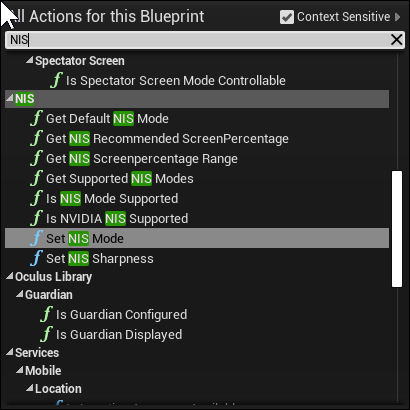

NVIDIA Image Scaling Unreal Engine Plugin
================================================

NVIDIA *图像缩放*虚幻引擎插件是更广泛的相关NVIDIA性能和图像质量改进技术套件的一部分，以及相应的NVIDIA虚幻引擎插件:

- NVIDIA *图像缩放(NIS)*为非rtx gpu (NVIDIA或第三方)提供一流的升级和锐化。
- NVIDIA *深度学习超采样(DLSS)* 用于在最大图形设置下提供尽可能高的帧速率。*DLSS*需要NVIDIA RTX显卡。
- NVIDIA *深度学习抗锯齿(DLAA)* 用于提高图像质量。*DLAA*需要NVIDIA RTX显卡。
- 有关*DLSS*和*DLAA*的详细信息，请参阅NVIDIA *DLSS/DLAA*虚幻引擎插件。

# 快速开始

详情请参阅本文件的相关章节。（进处效果很不错，远处效果一般，有闪烁，回头可以对比一下AMD的FSR）

1. 在编辑器中启用*NIS*插件，然后重新启动编辑器
2. NIS in [Blueprint](#nis-blueprint-library): The `SetNISMode` and `SetNISSharpness` function of the NIS blueprint library provides convenient functions for setting the following console variables and are recommended to be used when integrating support into a project's user interface and settings.
3. NIS in [Blueprint](# NIS - Blueprint -library): NIS蓝图库中的`SetNISMode` 和`SetNISSharpness`函数提供了设置以下控制台变量的方便函数，建议在将支持集成到项目的用户界面和设置时使用。
4. NIS upscaling 在游戏中: 这些 [console variables](#command-line-options-and-console-variables-and-commands) 能被用来启动NIS:
   1. r.NIS.Enable 1
   2. r.NIS.Upscaling 1
   3. r.ScreenPercentage 50
   4. r.TemporalAA.Upsampling 0
   5. r.TemporalAA.Upscaler 0
   4. *Optional* r.NIS.Sharpness 0.5
5. NIS sharpening in game: The following [console variables](#command-line-options-and-console-variables-and-commands) can be set to enable a NIS sharpening pass regardless of whether temporal or spatial upscaling is used.
6. 游戏中的NIS锐化:可以设置以下[控制台变量](#command-line-options-and-console-variables-and-commands)来启用NIS锐化通道，而不管使用的是时间采样（temporal upscaling）还是空间采样（spatial upscaling）。
   1. r.NIS.Enable 1
   2. r.NIS.Sharpness 0.5

# 故障排除

## 系统要求

- A GPU supporting SM5
- UE 4.27.1 or higher
- A project targeting the SM5 renderer and using either:
  - Vulkan
  - DX11
  - DX12

## <a name="nis-blueprint-library">NIS蓝图库</a>

UNISLibrary蓝图库提供了查询是否支持NIS以及支持哪些模式的功能。它还提供了方便的函数来启用底层NIS控制台变量。每个函数的工具提示提供了额外的信息。

建议通过blueprint或c++使用UNISLibrary(通过在游戏项目中包含NISBlueprint模块)而不是直接设置控制台变量。这将确保未来的任何更新都将通过简单地更新NIS插件来获取，而不必更新游戏逻辑。

## DLSS and the NIS NVIDIA Image Scaling plugin (UE 4.27.1+)

*DLSS*插件和NVIDIA Image Scaling (*NIS*)插件可以在同一个项目中同时启用。请参阅“RTX UI开发者指南”文档，了解推荐的UI实现。.

当一个项目同时启用了*DLSS*和*NIS*插件时，将使用NIS锐化而不是DLSS锐化。看到`r.NGX.DLSS.PreferNISSharpen`在*DLSS*插件详细信息。

## NIS和其他空间采样高级插件之间的交互

该引擎支持为单个项目启用多个空间升级插件。然而，同一时间只有一个人可以**激活**。如果插件尝试，引擎将在`FViewFamily::SetPrimarySpatialUpscalerInterface`中断言
当另一个插件之前已经设置了空间上层接口。
为了避免这个断言和随后的引擎崩溃，*NIS*插件尝试检测另一个空间扩展插件可能已经激活并禁用自己的情况，在屏幕上显示如下消息:

修复方法是改变UI和游戏逻辑，在运行时只有一个空间采样高级插件**激活**。

## Panini Projections

NIS插件目前不支持Panini投影。

# <a name="command-line-options-and-console-variables-and-commands">命令行选项And 控制台选项and 命令</a>

## 启用NIS(引擎端)

*NIS*插件使用各种引擎端钩子，可以通过以下CVAR进行配置。

**提示**：默认情况下，引擎更喜欢临时升级(内置或通过临时升级插件，如*DLSS*插件)。因此，需要更改一些控制台变量以关闭临时采样（temporal upscaling）。

- r.TemporalAA.Upsampling 0
  - 禁用内置时间上采样(即TAAU/TSR)
- r.TemporalAA.Upscaler 0
  - 禁用内置时间上采样(即TAAU/TSR)
- r.ScreenPercentage 50 ... 100
  - 调整屏幕百分比

NIS支持一组质量模式，其中包含推荐的屏幕百分比，以及自定义的屏幕百分比。
The recommended screen percentages can be retrieved via the `GetNISRecommendedScreenPercentage` Blueprint function or as excerpted below from the accompanying [RTX Developer Guidelines](RTX UI Developer Guidelines.pdf) document:
建议的屏幕百分比可以通过 `GetNISRecommendedScreenPercentage` Blueprint函数检索，或从附带的[RTX开发人员指南](RTX UI开发人员指南.pdf)文档中摘录如下:

| Mode | r.ScreenPercentage  |
| ---- | ------------------- |
| Ultra Quality |77 |
| Quality |66.667|
| Balanced |59|
| Performance |50|
| Custom |50 .... 100|

Note: 为了方便起见，' SetNISMode '蓝图函数也基于NIS模式设置r.ScreenPercentage。

**Blueprint** functions:
- `SetNISMode`
- `IsNISSupported`
- `IsNISModeSupported`, `GetNISDLSSModes`,`GetNISRecommendedScreenPercentage`, `GetNISScreenPercentageRange`

## 启用 NIS (插件测)

- r.NIS.Enable (1, default)
  - 启用/禁用NIS升级和/或锐化
- r.NIS.Upscaling (1,default),
  - 开启NIS升级。也需要 r.TemporalAA.Upscaler 0

**Blueprint** functions:
- `SetNISMode`
- `IsNISSupported`
- `IsNISModeSupported`, `GetNISDLSSModes`,`GetNISRecommendedScreenPercentage`, `GetNISScreenPercentageRange`

## NIS 运行时图像质量调整
- r.NIS.Sharpness (0.0, default)
  - 0.0到1.0:锐化以应用于主NIS通道或从NIS通道。如果是0.0，则不会执行从NIS锐化通道
- r.NIS.HDRMode (-1, default)
  - -1: 自动的。根据ETonemapperOutputDevice判断NIS HDR模式
  - 0: None
  - 1: Linear
  - 2: PQ

**Blueprint** functions:
- `SetNISSharpness`

## Miscellaneous (杂项)

- r.NIS.HalfPrecision,(-1, default)
  - 在NIS着色器中启用/禁用半精度，并选择使用哪种排列
  - -1: 自动的。根据着色器模型和RHI选择合适的FP16排列
  - 0: Float32,       禁用半精度
  - 1: Min16Float,    一半精度，适用于UE4 DX11 SM5
  - 2: Min16FloatDXC, 一半精度，适用于UE4 DX12 SM5
  - 3: Float16DXC,    half precision, intended for UE5 DX12 SM6

Note: 半精度支持只在DX11和DX12上进行了测试。最可靠的结果是将项目配置为在虚幻引擎5上使用Shader Model 6和DX12运行。

## 为NIS启用自动Mip-Map LOD偏差选择

应用程序建议将mip-map偏差(也称为纹理LOD偏差)设置为低于0的值。这将提高整体图像质量，因为纹理是在显示分辨率下采样的，而不是在NIS中使用的较低渲染分辨率。具体请参见《NIS编程指南》(NIS_SDK_Programming_Guide.pdf)中“*5.1 Mip-Map Bias*”章节。

当运行空间升级插件时，引擎不会这样做。在这种情况下，建议应用程序手动调整。 `SetNISMode` Blueprint库函数执行这个依赖于解析的mip-map LOD偏差调整，可以使用以下控制台变量进行配置:

- r.NIS.Upscaling.AutomaticMipMapLODBias (1, default)
  - 根据有效的NIS屏幕百分比自动设置r.MipMapLODBias
  - NOTE: 这只适用于使用UNISLibrary::SetNISMode蓝图函数时
- r.NIS.Upscaling.AutomaticMipMapLODBias.Offset (0, default)
  - 允许用这个量来抵消依赖于自动分辨率的mip映射LOD偏差
  - NOTE: 这只适用于使用UNISLibrary::SetNISMode蓝图函数时

**Blueprint** functions:
- `SetNISMode`

Note: 引擎自动计算基于屏幕百分比的mip映射LOD偏差时，运行与时间升级，无论是内置(即TAAU/TSR)或通过插件，如DLSS

