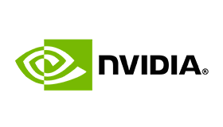
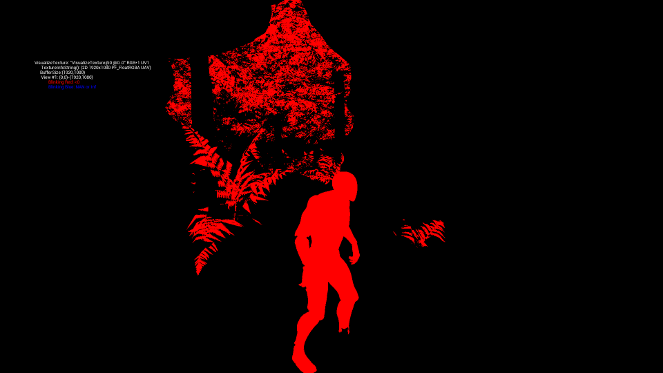

# NVIDIA 实时降噪(NRD)插件
======================================

# 快速启动

详情请见下文

1. 在编辑器中启用NRD插件，然后重新启动编辑器
2. 在项目设置中启用raytracig
3. 通过项目的控制台变量/ DefaultEngine.ini启用RTXDI和NRD
   - r.RayTracing.SampledDirectLighting 1
   - r.RayTracing.SampledLighting.Denoiser 2

# 故障排除

- 问题:“Swimming”阴影上的动画几何，如树叶和草
  - 补救措施：通过“vis NRD.Input.MotionVectors uv1”验证正确的速度/运动向量。确保草和树叶和其他动画网格显示在那里。如果没有，请参阅本文档中关于[启用运动向量](#enabling-motion-vectors-for nrd-降噪器)的部分
  

## System requirements系统要求

- Windows 10, 64 bit
- NVIDIA Geforce Driver
- NVIDIA RTX GPU (GeForce, Titan or Quadro) with [DLSS](https://www.nvidia.com/en-us/geforce/technologies/dlss/) support
- ReLAX漫反射/镜面降噪器目前仅由NVIDIA RTXDI实现在以下分支中支持
  - TODO ADD BRANCH LINKS
- UE4光线追踪项目，此时由
  - DX12

## ##验证引擎侧插件挂钩

应该设置以下cvars以启用RTXDI和ReLAX去噪器
- 启用光线追踪(也可以通过项目设置完成)
  - r.SkinCache.CompileShaders 1
  - r.RayTracing 1
- 启用RTXDI和NRD去噪器
  - r.RayTracing.SampledDirectLighting 1 
  - r.RayTracing.SampledLighting.Denoiser 2

# 命令行选项 And 控制台值 and 命令
  
## 为NRD去噪器启用运动向量
  
NRD需要正确的运动向量才能正常工作。下面的控制台变量可以设置为1，并用于渲染所有对象的运动向量，而不仅仅是具有动态几何结构的对象。这可以是有用的，如果它是不可行的，例如改变所有的网格静止或动态。

- r.BasePassOutputsVelocity (0, default)
  - 启用渲染基础通道上的WPO速度。
  - 0: 渲染在一个单独的通道/渲染目标，所有可移动的静态网格+动态
  - 1: 在常规的基础通道中添加一个额外的`GBuffer`渲染，但是允许基于时间的WPO在材料上进行运动模糊

- r.BasePassForceOutputsVelocity (0, default)
  - 强制基础通道计算运动矢量，不管FPrimitiveUniformShaderParameters。
  - 0: Disabled
  - 1: Enabled
  
## NRD/ReLAX 运行时图像质量调整

NRD/ReLAX漫射镜面降噪器提供了各种控制台变量来调整和调谐它的图像质量与RTXDI/ReSTIR直接照明光线跟踪算法一致。

Please refere to the [ReLAX GTC presentation TODO UPDATE ULR](https://www.nvidia.com/en-us/geforce/technologies/dlss/) on technical details

## History（历史）
  - r.NRD.Relax.History.SpecularMaxAccumulatedFrameNum    
    - specular signal时间累积的历史帧数[0…63] (默认值= 63)
    
  - r.NRD.Relax.History.SpecularFastMaxAccumulatedFrameNum 
    - 响应镜面specular signal时间累积的历史帧的数量  [0 ... 63] (Default = 4) 
    
  - r.NRD.Relax.History.DiffuseMaxAccumulatedFrameNum   
    - diffuse signal漫反射信号时间累积的历史帧的数量 [0 ... 63] (Default = 63)
    
  - r.NRD.Relax.History.DiffuseFastMaxAccumulatedFrameNum 
    - 用于快速响应signal时间累积的历史帧的数量[0 ... 63] (Default = 4) 
    
## Reprojection (重投影)
  - r.NRD.Relax.Reprojection.SpecularVarianceBoost 
    - 如果重新投影置信度较低[0.000000...8.000000] (默认值=1.000000)，我们向镜面反射注入多少量值
    
  - r.NRD.Relax.Reprojection.HistoryClampingColorBoxSigmaScale 
    - 用于将正常历史颜色钳制为响应`历史颜色的颜色框`的标准偏差比例[1.000000...10.000000] (默认值=1.000000)
    
  - r.NRD.Relax.Reprojection.BicubicFilter 
    - 在重新投影[0...1]期间对历史记录进行较慢但更锐利的过滤(默认值=1)
    
  - r.NRD.Relax.Reprojection.DisocclusionThreshold 
    - disocclusion detection/geometry tests 的深度值的百分比[0.001000...1.000000] (默认值=0.010000)
    
## Discocclusion Fix (错位修复)
  - r.NRD.Relax.DisocclusionFix.EdgeStoppingNormalPower 
    - 交叉双边稀疏滤波器的正常边沿阻挡 [0.000000...128.000000] (默认值=8.000000)

  - r.NRD.Relax.DisocclusionFix.MaxRadius 
    - 稀疏双边滤光片的最大半径，以像素[0.000000...100.000000] 表示 (默认值=8.000000)
    
  - r.NRD.Relax.DisocclusionFix.NumFramesToFix 
    - 交叉双边稀疏过滤器将应用于历史长度小于此值 [0...10] (默认值=2)的帧

## Anti Lag (抗滞后)
  - r.NRD.Relax.AntiLag.SpecularColorBoxSigmaScale 
    - 滞后检测镜面彩盒标准偏差刻度 [1.000000…10.000000] (默认值= 2.000000)
    
  - r.NRD.Relax.AntiLag.SpecularPower 
    - 检测到镜面滞后时历史缩短量[0.000000…100.000000] (默认值= 0.000000)
    
  - r.NRD.Relax.AntiLag.DiffuseColorBoxSigmaScale 
    - 滞后检测漫反射色盒标准差尺度[1.000000…10.000000] (默认值= 2.000000)
    
  - r.NRD.Relax.AntiLag.DiffusePower 
    - 检测到扩散滞后时历史缩短的数量[0.000000…100.000000] (默认值= 0.000000)

## Spatial Variance Estimation (空间方差估计)
  - r.NRD.Relax.SpatialVarianceEstimation.HistoryThreshold 
    - 历史长度阈值，低于该阈值将应用空间方差估计[0…10] (默认值= 3)

## A-trous filter (A-Trous过滤器)
  - r.NRD.Relax.Atrous.Iterations 
    - A-Trous过滤器的迭代次数。[2...8] (默认值=5)
    
  - r.NRD.Relax.Atrous.DiffusePhiLuminance  
    - A-trous缘停止漫反射亮度灵敏度[0.000000...10.000000] (默认值=1.500000)
    
  - r.NRD.Relax.Atrous.SpecularPhiLuminance 
    - A-trous edge stopping specular Luminance sensitivity. [0.000000 ... 10.000000] (Default = 1.500000) 

  - r.NRD.Relax.Atrous.PhiNormal 
    - 漫反射的A-trous边缘停止法线灵敏度[0.100000...256.000000] (默认值=64.000000)

  - r.NRD.Relax.Atrous.PhiDepth 
    -  A-trous边缘停止深度敏感度. [0.000000 ... 1.000000] (Default = 0.050000) 
    
  - r.NRD.Relax.Atrous.RoughnessEdgeStoppingRelaxation 
    - 在镜面反射重投影较低的区域中,我们放宽了多少基于粗糙度的拒绝[0.000000,1.000000] (默认值= 0.300000)
    
  - r.NRD.Relax.Atrous.NormalEdgeStoppingRelaxation 
    - 在镜面重投影较低的区域，我们放松多少正常的排斥反应。[0.000000……1.000000] (默认值= 0.300000)
    
  - r.NRD.Relax.Atrous.LuminanceEdgeStoppingRelaxation 
    - 在镜面重投影较低的区域，我们在多大程度上放松基于亮度的拒绝 [0.000000…1.000000] (默认值= 1.000000)

## Misc
  - r.NRD.Relax.FireflySupression 
    - 是否压制Firefly[0…1] (默认值为0)，也就是FSR

  - r.NRD.Relax.SplitScreen.Percentage 
    - 在哪里在输入和去噪输出之间分割屏幕。In Percent[0…100] (默认值为0)

  - r.NRD.DenoisingRange 
    - 世界几何空间范围[0.000000…100000000 .000000] (默认值= 10000.000000)

  - r.NRD.Relax.DiffuseRadianceCompression 
    - 是否压缩输入/输出端的漫反射亮度。这可以帮助在高亮显示中防止丢失细节[0…1] (默认值为0)

  - r.NRD.Relax.SpecularRadianceCompression 
    - 是否压缩输入/输出的镜面亮度。这可以帮助在高亮显示中防止丢失细节 [0…1] (默认值为0)
