# RTXGI Unreal Engine Plugin

为了将RTXGI的优势带给尽可能多的开发人员，所有RTXGI 1.1特性现在都可以通过RTXGI UE插件在虚幻引擎中使用。

要使用RTXGI UE插件，首先需要满足以下软件和硬件要求:

**Software软件版本**

-   Windows 10 v1809 or higher.
-   The latest drivers for your GPU. NVIDIA drivers [are available here](http://www.nvidia.com/drivers).
-   Unreal Engine version 4.27 or 5.x

**Hardware硬件要求** 

 Any DXR enabled GPU. NVIDIA DXR enabled GPUs:
 -   Titan RTX
 -   RTX 3090, 3080 Ti, 3080, 3070 Ti, 3070, 3060 Ti, 3060, 3050
 -   RTX 2080 Ti, 2080 SUPER, 2080, 2070 SUPER, 2070, 2060 SUPER, 2060
 -   GTX 1660 Ti, 1660 SUPER, 1660
 -   GTX 1080 Ti, 1080, 1070, 1060 with at least 6GB of memory


## 如果有问题请反馈
| **Note** |
| -------- |
| **Problems, Feedback, and Bugs** If you encounter any problems, have feedback, or would like to report a bug, please contact: <rtxgi-support-service@nvidia.com> |

## 开始
**设置你的项目默认的RHI到DirectX 12并且启用 Ray Tracing** 在项目设置之中，在同时光追要求使用DirectX 12 在虚幻引擎中。

-   进入 *Project Settings&rarr;Platforms&rarr;Windows&rarr;Targeted RHIs&rarr;Default RHI* and select DirectX 12.
    -   确保“DirectX 11 & 12 (SM5)”复选框也已选中。

-  进入 *Project Setting->Engine->Rendering->Ray Tracing* and并且检查是否开启了光追选项.
-   （可选)启用*强制No预计算照明*以避免加倍照明贡献(即混合RTXGI和预计算间接照明)。
    -   禁用当前级别中预先计算的照明, 选择 *World Settings->Lightmass->Force No Precomputed Lighting*.
    -   禁用全局预计算照明，禁用 *Project Settings->Engine->Rendering->Lighting->Allow Static Lighting*.

接下来，导航到插件区域 and **启用  RTX Global Illumination (RTXGI) plugin**.

-   在编辑器中, 进入 *Settings->Plugins*.
-   在插件的日志中, 进入 *Built->endering*.
-   *启动*  NVIDIA RTX Global Illumination plugin.

-   *重启编辑器*
 4.27:
    -  设置`r.GlobalIllumination.ExperimentalPlugin`  cvar` 0 到 1 `以启用全局照明插件(在' .ini '文件中设置，在控制台或在蓝图中)。
-   5.x:
    -   设置 `r.DynamicGlobalIlluminationMethod` cvar 到 `4` 去启用全局光照插件 (在设置文件中 `.ini` , 打开这个命令, 或者在蓝图中打开).也可以在项目设置中进行更改。在rendering 选项中, 选择插件 **Plugin** 为全局动态光照 **Dynamic Global Illumination Method**.

    -   作为一种替代方法，在后处理设置中将动态全局照明方法重写为插件。postprocess设置覆盖cvar。(非全局的方式)

-   设置 `r.RTXGI.DDGI` cvar 到 `1`去 启用 RTXGI (设置在 `.ini` 文件, 在控制台, 或者在蓝图中).
-   在场景中放置DDGIVolume actor，并在体积中中使用RTX全局照明。
-   就这些. 去让它玩美起来 with RTXGI! 学习更多关于 RTXGI [Functionality](#functionality) and usage in the [Artist Overview](#artist-overview). 
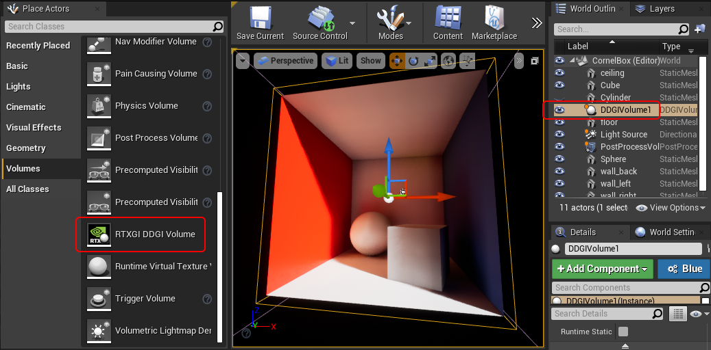

## <a name="functionality">功能</a>

RTXGI实现了*动态漫反射全局照明(DDGI)* 算法来计算漫反射全局照明。DDGI使用射线追踪来收集辐照度和距离数据在一个规则的探测器网格上。这类似于您可能已经熟悉的现有辐照度探头解决方案，但辐照度和距离计算现在是实时进行的。RTXGI探头在时间上积累数据，并使用基于统计的方法来解决可见性和防止光线泄漏。

**To use RTXGI in UE, place DDGIVolume actor(s) in the scene**. These volumes contain a grid of probes that RTXGI updates with ray tracing. One `DDGIVolume` is updated per frame in a weighted round robin fashion using the volume's **Update Priority** property.
**在UE中使用RTXGI，在场景中放置DDGIVolume actor.** 这些卷包含RTXGI用射线跟踪更新的探针网格。使用卷的 ***Update Priority*** 属性以加权轮询方式每帧更新一个 `DDGIVolume` 。

`DDGIVolume`的各种属性可以调整，这些属性将在下面讨论。

### RTXGI Volume 属性

动态间接照明是通过RTXGI在体量内产生的。' DDGIVolume '有许多可以调整的属性(如下所示)，但默认值应该适用于许多情况。

 # GI 体积 `DDGIVolume` 属性 
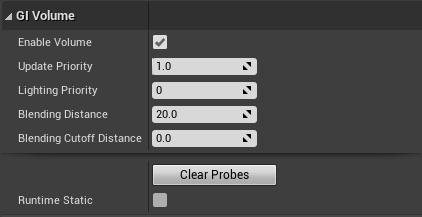 

| Property                 | Description                                                                                                                                                                                                                                                                                                                                                                                                                                                                                     |
|--------------------------|-------------------------------------------------------------------------------------------------------------------------------------------------------------------------------------------------------------------------------------------------------------------------------------------------------------------------------------------------------------------------------------------------------------------------------------------------------------------------------------------------|
| Enable Volume            | 手动的启用或者禁用这个体积 |
| Update Priority          | 使用加权循环系统来更新体积。更新优先级值较高的体积更新更频繁。因此，随着更多的体积添加到场景中，系统更新所有体积所需的时间将会更长。|
| Lighting Priority        | 允许自定义卷优先级的值。如果视图锥体中同时存在多个体积，则将选择最密集的体积并将其用于将间接照明应用于附近的曲面。如果要覆盖此行为，请为要使用的体积提供最低的照明优先级值(并增加其他体积的照明优先级值)。|
| Blending Distance        | 指定DDGIVolume如何以世界空间单位在卷的边缘混合。这用于在卷的边缘创建褪色区域，可以用作艺术控制。例如，如果你想在一个体量的顶部设置拱形天花板，以减少光线。 |
| Blending Cutoff Distance | 从一个体积的边缘到它的重量为零的距离(即变黑或屈服于一个包围的体积)，以世界空间为单位。如果你不想让线性渐隐一直到边缘，这很有用。 |
| Clear Probes             | 刷新存储在卷探测中的当前数据。|
| Runtime Static           | 标记为运行时静态的卷将在作者时在探针中存储间接照明，并且不会在游戏期间动态更新。这可以用来降低性能成本。例如，在关卡中放置一个大的静态体积，并将其标记为运行时静态，以在编辑器中计算间接照明来填充场景。然后在运行时使用更小、更密集的DDGIVolumes在感兴趣的地方进行动态间接照明 |

# GI 探针 ``DDGIVolume`` 属性 
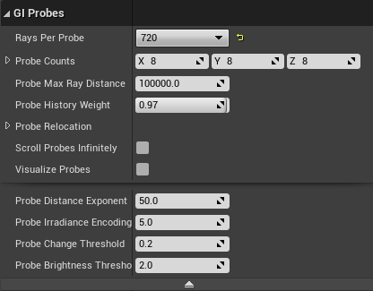

| Property                        | Description                                                                                                                                                                                                                                                                                                                                                                                                                                                                                    |
|---------------------------------|------------------------------------------------------------------------------------------------------------------------------------------------------------------------------------------------------------------------------------------------------------------------------------------------------------------------------------------------------------------------------------------------------------------------------------------------------------------------------------------------|
| Rays Per Probe                  | 设置每个探测跟踪的射线数。每个探头追踪的射线数量越多，就会产生更稳定的间接照明，从而提高图像质量，但会有更高的性能成本。在许多情况下，默认的288射线每个探针工作良好。 |
| Probe Counts                    | 设置放置在DDGIVolume的每个轴上的探测数量。在一个卷中通常不需要很高的探针计数。我们建议每隔2-3米布置一个探针网格。稀疏的探针网格通常比密集的探针网格产生更好的视觉效果，因为密集的探针网格本地化了每个探针的效果，并且可以(有时)揭示探针网格的结构。如果有疑问，请使用最少数量的探测来获得所需的结果。 |
| Probe Max Ray Distance          | 探测射线能传播的最大距离。没有表面被击中超过这个距离。在某些场景中，降低这个值可以提高性能。 |
| Probe History Weight            | 探测射线能传播的最大距离。没有表面被击中超过这个距离。在某些场景中，降低这个值可以提高性能。范围为[0,1]的值会影响探测中光线跟踪结果的时间累积。值1总是使用现有的探测值并忽略最新的射线跟踪信息。值为0总是使用最新的射线跟踪信息，并忽略所有以前的探测数据。最好将此属性设置为平衡先前和最新射线跟踪数据的值。默认值0.97在大多数情况下都很好。 |
| Automatic Probe Relocation      | 根据周围的世界几何形状调整每一帧探针的位置。探头被移动到光线更好的位置，而不是(例如)放置在墙壁或其他物体内部。 |
| Probe Min Frontface Distance    | 探针重定位移动探针之前，允许与正面三角形的最小距离。 |
| Probe Backface Theshold         | 在探针重定位和状态分类之前，探针投射到背面三角形的光线比例假设探针在几何内部。 |
| Scroll Probes Infinitely        | 将卷转换为无限滚动卷。卷变得与世界轴对齐，当卷移动时，卷最外层边缘上的探针在移动方向上重新定位到卷的另一端(像坦克链条那样“滚动”卷)。通过这种方法，当体积移动时，大多数探针保持它们在世界空间中的位置，从而获得更稳定的照明结果。 |
| Visualize Probes			      | 将当前体积的探针显示为球体网格。这对于调试很有用。可以从项目设置中更改所有卷的可视化数据或覆盖探针可视化。 |
| Probe Distance Exponent         | 可见性测试期间使用的指数。高值对深度不连续快速反应，但可能导致带状。|
| Probe Irradiance Encoding Gamma | 一个指数，感知编码辐照度，以加快光到暗的收敛。|
| Probe Change Threshold          | 探针亮度混合时使用的比率。指定一个阈值，用于识别何时发生较大的照明变化。当先前和当前辐照度之间的最大颜色分量的差值大于此阈值时，迟滞将会减小。|
| Probe Brightness Threshold      | 探针亮度混合时使用的比率。指定一个阈值，用于识别何时发生较大的照明变化。当先前和当前辐照度之间的最大颜色分量的差值大于此阈值时，迟滞将会减小。在探头亮度混合过程中使用的阈值，用于确定先前和当前辐照度值之间允许的最大亮度差。这可以防止脉冲在单个更新周期中大幅改变texel的辐照度。 |

#  GI Lighting ``DDGIVolume`` Properties 
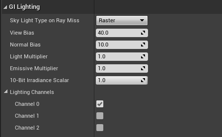      

| Property                   | Description                                                                                                                                                                                                                                                                                          |
|----------------------------|------------------------------------------------------------------------------------------------------------------------------------------------------------------------------------------------------------------------------------------------------------------------------------------------------|
| Sky Light Type on Ray Miss | 无/光栅/光线追踪-指定哪种类型的天空光有助于DDGIVolume计算光线错过场景的几何。 除开 ``DDGIVolume`` 你可以改变天光类型 `r.RayTracing.SkyLight`. |
| View and Normal Bias       | 类似于阴影映射偏差，这些属性有助于调整可见性工件。如果你看到光线或阴影泄漏的问题，调整这些偏置值。**一般情况下，视图偏差值应该比正常偏差大4倍**。|
| Light Multiplier           | 使用此设置可人为地增加或减少GI照明对该Volume的贡献。请注意，这个倍增器也会影响发光表面的照明贡献。 |
| Emissive Multiplier        | 使用此设置可人为地增加或减少该体积中辐射对GI的贡献。 |
| 10-bit Irradiance Scalar   | 使用10位辐照度纹理格式时，用于在存储前缩放照明大小的\[0，1\]值。读取后重新构建缩放值，从而允许以10位纹理格式存储更大的辐照度值。这将导致内存消耗. |

### 蓝图概览
RTXGI向蓝图公开了几个功能。
这允许使用蓝图编辑器实现逻辑，以便在运行时控制不同的DDGI卷属性。所有的功能都归入了‘DDGI’类别，如下所示：


| Blueprint Node              | Description |
|-----------------------------|---------------------------------------------------|
| Clear Probe Data            |  Flushes current data stored in volume probes. |
| Get ``Emissive Multiplier``, ``Irradiance Scalar``, ``Light Multiplier``, ``Update Priority``, ``Lighting Priority``, ``Blending Distance``, ``Blending Cutoff Distance``, ``View Bias``, ``Normal Bias``|  Retrieves the current value for the corresponding property. |
| Set ``Emissive Multiplier``, ``Irradiance Scalar``, ``Light Multiplier``, ``Update Priority``, ``Lighting Priority``, ``Blending Distance``, ``Blending Cutoff Distance``, ``View Bias``, ``Normal Bias`` |  Changes the value of the corresponding property. |
| Toggle Volume               |  Enable or disable the target volume. |
| Set Probes Visualization    |  Toggles probes visualization for the target volume. |

所有蓝图函数都可以通过``DDGIVolume组件``访问。在``DDGIVolume``执行元上调用Blueprint函数时，Blueprint编辑器将自动添加必要的``DDGIVolume Component``。

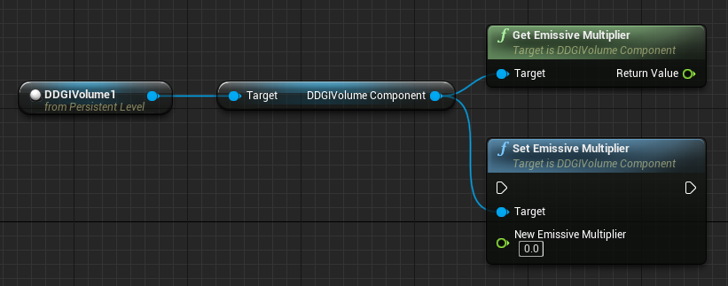

有几个新的控制台变量(“CVAR”)可用于RTXGI。下表对这些内容进行了说明。

### RTXGI 控制台变量

| Command                           | Options    | Description                                                                                                                                                                                                        |
|-----------------------------------|------------|--------------------------------------------------------------------------------------------------------------------------------------------------------------------------------------------------------------------|
| `r.RTXGI.DDGI`                    | 0, 1       | 开关 RTXGI 打开或者关闭.                                                                                                                                                                                           |
| `r.RTXGI.DDGI.LightingPass.Scale` | 0.25 - 1.0 | 照明过程分辨率的比例介于0.25-1.0之间(值限制在此范围内)。                                                                                                                        |
| `r.RTXGI.DDGI.ProbesTextureVis`   | 0, 1, 2    | 切换探头可视化。这使用户可以从摄像机的角度看到探测器看到的内容。在模式2中，它以蓝色显示光线未命中，以绿色显示光线命中，以红色显示光线背面命中。             |
| `r.RTXGI.MemoryUsed`              | None       | 在输出日志中显示RTXGI正在使用的视频内存的摘要和详细信息。                                                                                                                               |
| `Vis DDGIProbesTexture`           | None       | 允许用户从`r.RTXGI.DDGI.ProbesTextureVis`命令查看纹理。这有助于诊断由于光线跟踪未配置为可见的照明或几何体导致的探头中的不准确性。 |
| `r.RTXGI.DDGI.StatVolume`         | Integer    | 显示其卷状态的索引。
每体积统计信息包括Num Samples、Probe Count X Y Z和Num Ray。  |

### 项目设置

RTXGI插件在UE的项目设置对话框中有几个设置。

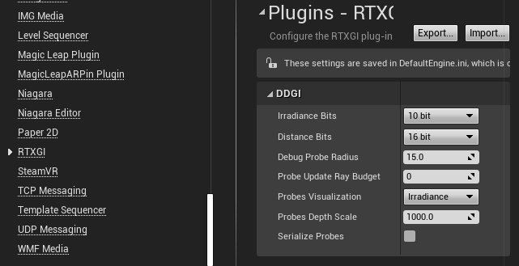

- **Irradiance Bits** - 默认情况下，使用每个颜色通道10位的纹理格式来存储探测器辐照度。对于扩展的辐射或非常明亮的光源，10位可能不足以正确地表示光的能量。可以将辐照度纹理的位深度增加到32位(使用RGBA32F纹理格式)，以支持扩展的辐照度，但代价是内存使用量增加。或者，使用10位辐照度，并调整*DDGIVolume*的**辐照度标量**选项，可以在存储前减小光照幅度，并在读取后将其放大。这以牺牲一些精度为代价来节省内存。.

- **Distance Bits** -默认情况下，16位浮点格式用于在探头中存储距离(和距离平方)，以便在确定遮挡时使用。当距离较大时，16位可能不够用。距离纹理的位深度可以增加到32位以提高精度。

- **Debug Probe Radius** - 设置可视化``DDGIVolume``探测时渲染的球体半径，以世界空间为单位。

- **Probe Update Ray Budget** - 设置更新探测时可能投射的最大光线数。0指定无限数量的光线。使用每个探测器288射线的8x8x8体积将指定147,456来完全更新每帧的所有探测器。根据卷的优先级，每帧更新一个卷。卷优先级越高，意味着卷更新的频率越高。通过这些设置，可以对性能成本设置上限，同时还可以控制体积接收的光线更新的比例(或光线滞后量)。

- **Probes Visualization** -默认情况下，可视化探针将显示它们的辐照度，可以可视化其他模式，包括命中距离和平方命中距离或禁用所有卷的探针可视化。在可视化距离的情况下，请检查下一个属性“Probes Depth Scale”来控制距离范围。

- **Probes Depth Scale** - 当'Probes Visualization'模式设置距离时，可以控制此属性以在探针上有更好的距离可视化。

- **Serialize Probes** - 默认情况下，探测数据在.umap文件中序列化。使用此选项可以禁用序列化，以便在磁盘上拥有更小的映射文件。禁用此选项的重新保存映射将擦除以前存储的任何现有数据。

### 运行时统计

使用`STAT RTXGI Performance`查看RTXGI运行时统计信息。所有统计数据都是时间的平均值。

- **Total Number of Volumes** - 场景中的卷总数
- **Selected Volume Index** - 所选卷的当前索引，由`r.RTXGI.DDGI.StatVolume` 设置
- **Num Samples (selected)** - 所选体积生成的样本总数。注意Num Samples是一个估计值，因为每条射线生成1 -(#个灯)个样本，精确计算Num sample会导致严重的性能损失。
- **Probe Count X (selected)** - X维上的探针数
- **Probe Count Y (selected)** - Y维上的探针数
- **Probe Count Z (selected)** - Z维上的探针数
- **Rays Per Probe (selected)** -每个探针的射线数
- **Samples Per Frame** - 所有卷的样本总数
- **RTXGI Samples Per Millisecond** - 每毫秒在所有卷上的样本数量
- **RTXGI Samples Per Frame 60hz** - 以60帧/秒的速度在所有卷上可能的样本数量，当当前帧/秒低于60时限制为0。
- **RTXGI GPU Time (ms)** - RTXGI每帧占用GPU时间的毫秒数
- **Total GPU Frametime (ms)** - 每帧GPU时间的毫秒数
- **Frametime Without RTXGI (ms)** - 每帧不带RTXGI的GPU时间的毫秒数

**限制**
   - RTXGI不能与UE的前向渲染路径一起工作。
   -RTXGI照明在UE的其他射线跟踪效果中是不可见的(例如，射线跟踪反射)。
   - In UE 4.27, RTXGI will be overriden by RTGI when setting the `r.RayTracing.ForceAllRayTracingEffects` cvar to `1`. In order to show the RTXGI results, this cvar should be set to its default value `-1`


# <a name="artist-overview">美术预览</a>

RTXGI为UE中的射线跟踪全局照明增加了高性能选项。顾名思义，RTXGI需要启用射线跟踪，并且插件处于活动状态。

如果光线追踪不可用，RTXGI插件将先前从具有光线追踪的平台(即DirectX 12)加载到磁盘中的探测纹理。


```ad-note
title:Note
当光线跟踪不可用时，例如在DirectX 11或Vulkan RHIs中，' ' DDGIVolumes ' '可以使用，但在静态模式下操作，探测器在运行时不更新。
```


```ad-note
title:Note
在“DDGIVolume”被放置在世界之后，探针会暂时累积反弹照明。
```

## RTXGI体积放置在UE

你可以在**Volumes**(如下所示)下找到`RTXGI DDGI Volume`  actor，并将其放置在关卡中。

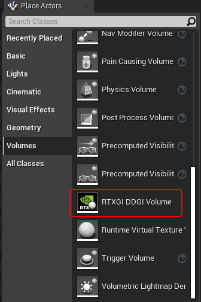

UE的所有原生变换小工具(平移、旋转和缩放)都可以用于使体积适合您的几何形状。


## ##提示和技巧

### 禁用光贴图
通过使用RTXGI作为项目的GI解决方案，建议禁用光图支持，因为您正在用RTXGI中的动态无限反弹GI替换Lightmass的烘焙GI。这有助于减少着色器排列，从而加快着色器编译。此外，`它有助于节省一些内存的静态网格，因为没有额外的UV需要烘烤光图。`

可以在项目设置中取消“允许静态照明”来禁用光照贴图支持。


对于光照贴图UV，这可以从静态网格导入选项中禁用。


如果静态网格已经生成了一个光照贴图UV，可以通过取消勾选“生成光照贴图UV”来从静态网格编辑器中删除它。

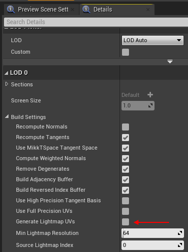

### 建议使用稀疏探测布局

相对稀疏的探测网格是实现高性能和高质量结果的良好实践。作为起点，我们建议在典型的人体尺度室内场景中，将探针彼此相距约2-3米。在大型户外场景中，你可以选择更稀疏的位置，但仍然可以获得很好的效果!


```ad-note
title:Note
根据设计，RTXGI不会** *生成高频细节。增加探针密度可以在一定程度上有所帮助，但它不会在任何密度下产生精确或锐利的照明和阴影。对于高频细节，使用其他形式的照明，如RTAO, RT天窗阴影和/或RT矩形灯。
```


你可以有多个不同探测密度的“DDGIVolumes”。该系统总是在密度较大的体积中使用探针。如果你需要在特定区域获得更高的精度，你可以这样做。它可能不需要昂贵的体积来实现更精确的采样。右下角的音量是5x5x5 ' DDGIVolume '，默认设置为每个探针288射线。这样的体积相对便宜，可以帮助实现您想要的结果!

| Recommended probe density | A higher density "detail" volume |
|---------------------------|----------------------------------|
|     | |

### 发光面是灯光源在 RTXGI
RTXGI的一个有趣特性是能够将发射物体视为光源。
```ad-note
title:Note
对于发射物体，光线追踪不局限于二次射线。RTXGI也会考虑第一个射线命中。从艺术家的角度来看，这意味着发射物体被认为是带有阴影投射的直接光源，类似于UE的参数化灯。
```
 
 *Emissive sphere generating direct lighting and casting direct shadows* 


在NVIDIA阁楼场景的这个例子中，窗户外面有大型的发射网格来产生额外的照明。

 
 *Emissive meshes added outside the NVIDIA Attic to add lighting* 


*任何发射表面都可以作为RTXGI的光源* RTXGI探头的发光网格越大，物理可用性越强，照明贡献越大。发射表面值也可以提高，以产生更多的光。使用这种方法，您可能会发现从10位辐照度切换到32位辐照度会更好，因为这提供了更详细的光贡献范围。**32位的辐照度应该谨慎使用**，因为它会增加内存成本3倍。只有在绝对必要时才启用32位辐照!

使用RTXGI，现在可以用更少的点灯，聚光灯和/或区域灯来点亮场景。相反，你可以依靠一些光源和发射表面的组合。这一变化不仅可以改善工作流程和迭代时间，还可以提高性能(因为灯光更少)。您可能会发现，最好采用RTXGI的小固定成本，而不是使用许多阴影投射灯。
**以这种方式照明场景是一种不同的方法，但可能会产生运行更快、更容易创建的结果**.

**这里有一个实际的例子:** 

发射网格产生额外的光，而不成为场景的可见部分。在UE中，发射网格可以标记为_仅对光线跟踪可见_。你可以创建“隐藏”的发射网格，以在可见网格太小而无法单独贡献的区域产生额外的照明。要做到这一点，使用`RayTracingQualitySwitch`节点。

| 从隐藏的发光网格体照明 | 隐藏的发光网格体可见 |
|-----------------------------------------------|-----------------------------------|
| 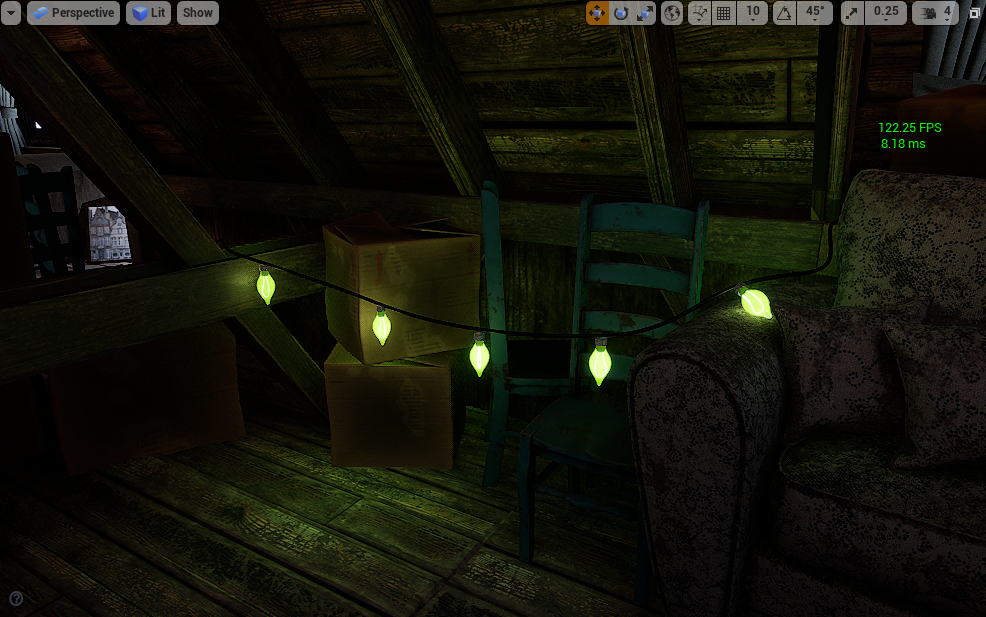            | 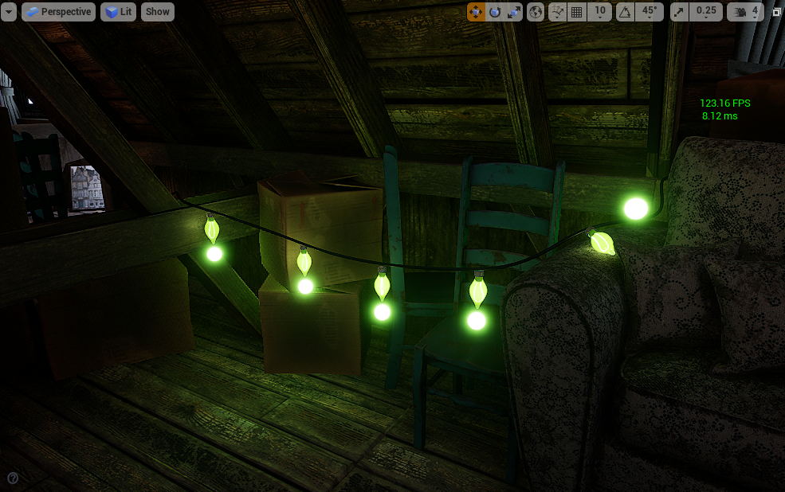      |

### 确保RTXGI在你想要的地方贡献光

RTXGI不会自动使每个表面更亮。它可能需要一些微调，最终的结果是你的材料，整体照明，后期处理设置和其他选择的组合。开始为全局照明贡献开发基线的一个方便的方法是在 `Lightingonly` 模式下查看场景。
`Lightingonly` 在这种情况下很有用，因为它显示的所有表面都是平坦的50%灰色。当打开和关闭RTXGI时，您将清楚地了解各种光源所产生的真正的全局照明贡献。

```ad-note
title:Note
即使表面显示为50%的灰色，它们仍然提供彩色照明和反弹，所以你可以很好地看到照明是怎么做的。
```
| Lightingonly 模式, 仅direct lighting  | Lightingonly 模式,  direct lighting 和 RTXGI |
|----------------------------------------------|---------------------------------------------------|
|                   |                       |

正如你所想象的，黑暗的表面不能很好地反射光(非常黑暗的表面根本不能反射光!)。如果你的纹理是暗的(通常低于50%的亮度阈值)，它们将有更少的反弹光和更小的整体照明贡献。这并不一定是一个坏结果。如果物体是非常黑暗的，那么照明是预期的，仍然是基于物理的。更亮的表面会产生更明显的反射光(因为它们反射了它)。想想像《镜之边缘》这样的游戏的视觉效果——它有着非常明亮和丰富多彩的表面，以及它展示了多少间接的反射光线。

### 终极建议

想想你的表面以及它们与全球照明的关系。如果你的目标是确保你的场景中有大量的间接光，即使是很小的值变化也会对最终的间接照明结果产生影响。在某些情况下，可能不需要太大的改变就能得到你想要的结果。

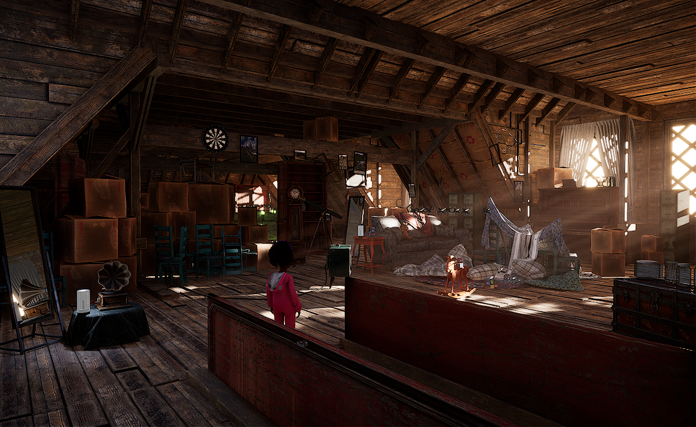

